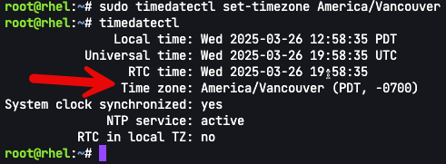

Welcome to the command line assistant problem solving lab.

command line assistant is intended to provide rapid access to Red Hat knowledge to help users solve problems as quickly as possible, through a natural language interface.

In this challenge, we'll get acquainted with the command line assistant.

Run the command line assistant
===

Let's ask command line assistant how to configure the time zone of our RHEL system to Vancouver, Canada. Click the run button in the top right corner of the code block below.

```bash,run
c "how do I configure the timezone to Vancouver Canada on the cli in RHEL 9"
```

Here's the output.


Let's execute the suggested solution.

```bash,run
timedatectl set-timezone America/Vancouver
```

To view the result, run the following, as suggested by command line assistant.

```bash,run
timedatectl
```



Let's try something more difficult. Click `Next` at the bottom corner of the screen to go to the next challenge.
