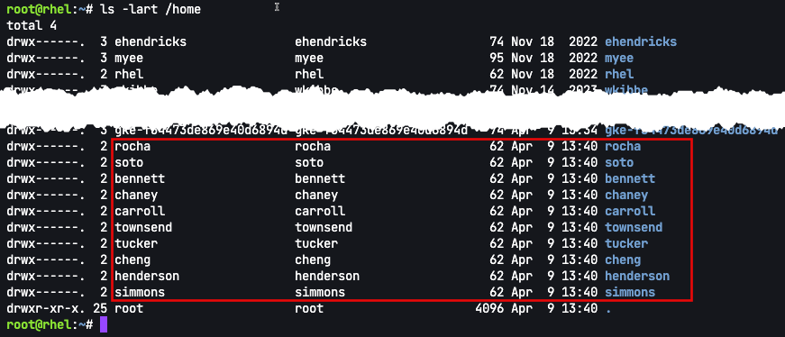

It may be the case that you will have to perform a repetitive task, such as creating user accounts, at least once in your life. Command line assistant can help you reduce the burden of such a task.

In this assignment, we'll pretend that you've been provided with an input file containing a list of users and their preferred shells. You have been asked to use this input file to generate user accounts.

Comma separated value input file
===

Let's take a look at the provided a comma separated value (csv) file containing usernames and preferred terminal shells.

You can take a look here.

```bash,run
cat ~/users.csv
```

We'll ask command line assistant to create a shell script to take the file `users.csv` as input and create users with their preferred shells.

Create the script
===

It's important to be very specific when asking command line assistant to write any sort of code. For example, we'll run the following request.

```bash,run
c "write a script that creates user accounts using a csv input file containing usernames and preferred shells in rhel9"
```

Here's the result, at the time that this lab was written.


> [!NOTE]
> Command line assistant makes use of a large language model (LLM) as well as a Retrieval Augmented Generation (RAG) database, generated from the corpus of Red Hat's knowledge base. Responses from command line assistant can vary, depending on the progress of training the LLM. It may be the case that you'll need to refine your question to command line assistant to obtain an accurate answer, especially if your question asks command line assistant to generate code such as a shell script.

Below is the output script generated by command line assistant at the time this lab was written. You can copy and paste this into `/root/create_user.sh` into the built-in text editor.

```bash
#!/bin/bash

# Check if a CSV file is provided as an argument
if [ -z "$1" ]; then
  echo "Usage: $0 <input.csv>"
  exit 1
fi

# Read the CSV file line by line
while IFS=, read -r username shell; do
  # Create the user with the specified shell
  useradd -m -s "$shell" "$username"

  echo "User '$username' with shell '$shell' created successfully."
done < "$1"
```

Run the script to create the new accounts
===

Run the script.

```bash,run
/root/create_user.sh users.csv
```

Let's check `/etc/passwd` to see if the new accounts were created.

```bash,run
cat /etc/passwd
```

Here's what the output should look like.


Let's check that home directories were created.

```bash,run
ls -lart /home
```


