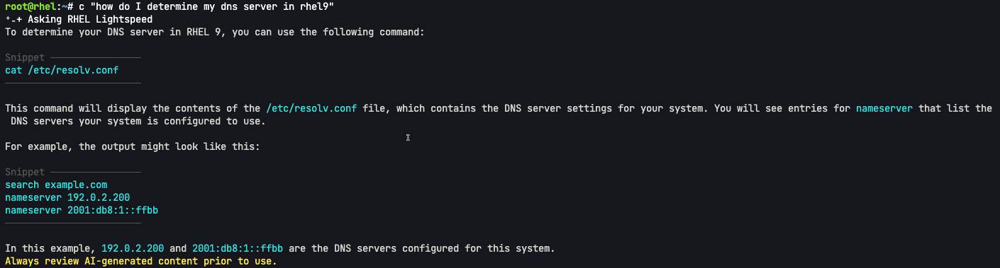
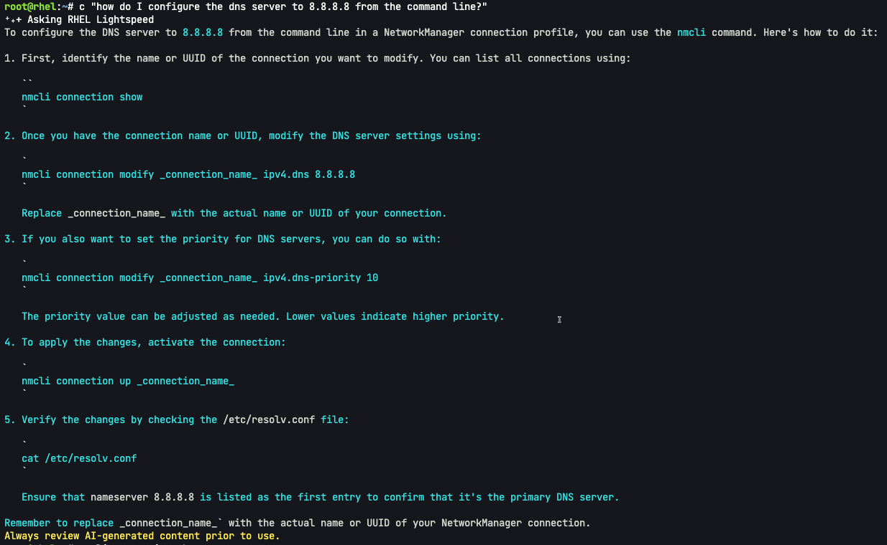
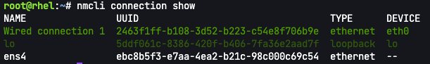
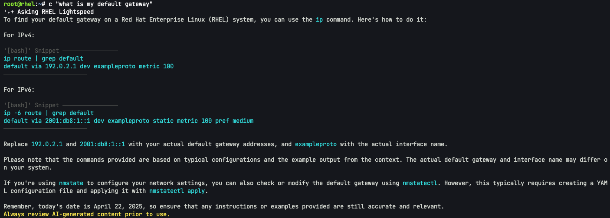
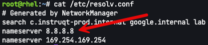
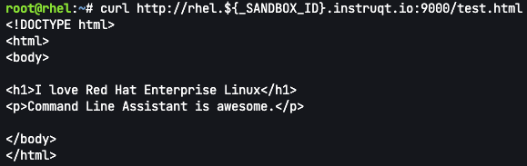

The command line assistant is useful for configuring and troubleshooting RHEL networking. In this assignment we'll use command line assistant to help us configure DNS as well as port redirection.

# Configuring DNS

Let's ask command line assistant what our DNS is configured to.

```bash,run
c "how do I determine my dns server in rhel9"
```

The output should look something like this.


Let's run the suggested command.

```bash,run
cat /etc/resolv.conf
```

The output will look like this.

```bash,nocopy
root@rhel:~# cat /etc/resolv.conf
# Generated by NetworkManager
search c.instruqt-prod.internal google.internal lab
nameserver 169.254.169.254
```

Let's add another DNS server.

```bash,run
c "how do I configure the dns server to 8.8.8.8 from the command line?"
```

The output will look like this.



When you run `nmcli connection show`, multiple connections are returned.

```bash,run
nmcli connection show
```



How do I know what connection to configure?

Let's see what connection is currently the default gateway and which NIC is being used.

```bash,run
c "what is my default gateway"
```



Let's run `ip route | grep default`.

```bash,run
ip route | grep default
```

Here's the output.

```bash,nocopy
root@rhel:~# ip route | grep default
default via 10.5.0.1 dev eth0 proto dhcp src 10.5.0.92 metric 100
```

We can see that the default route is set for eth0. eth0 is configured to `Wired connection 1`.

As per the instructions above, run the following command to configure the new DNS server.

```bash,run
nmcli connection modify Wired\ connection\ 1 ipv4.dns 8.8.8.8
```

Then we need to activate the connection.

```bash,run
nmcli connection up Wired\ connection\ 1
```

Check the results.

```bash,run
cat /etc/resolv.conf
```

We can see that `8.8.8.8` is now configured as a DNS server.



Configure port redirection
===
Let's configure our system to redirect requests to port 9000 to port 80. That way when we run `curl` against port 9000, we'll obtain the test webpage we created in the previous assignment.

Let's ask command line assistant how to do this.

```bash,run
c "how do I forward requests to port 9000 to 80"
```

We'll run the commands recommended by command line assistant.

```bash,run
firewall-cmd --zone=trusted --add-forward-port=port=9000:proto=tcp:toport=80 --permanent
```

```bash,run
firewall-cmd --reload
```

Let's test this out.

```bash,run
curl http://rhel.${_SANDBOX_ID}.instruqt.io:9000/test.html
```

Here's the result you should get.


