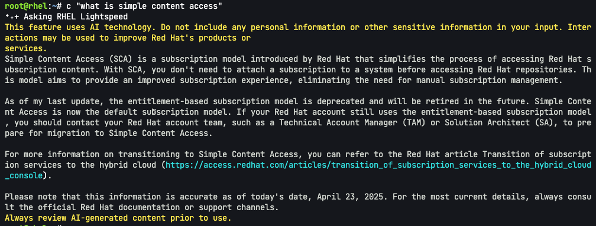
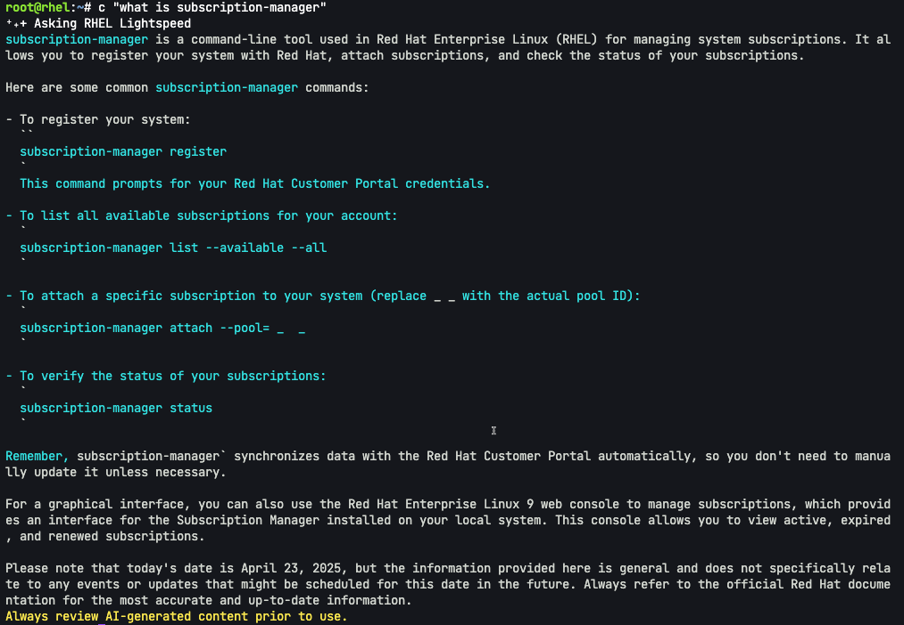
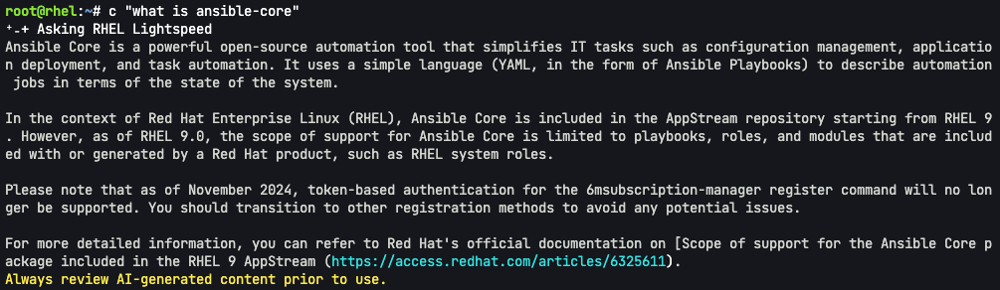

Command line assistant has the ability to return answers that make use of a Retrieval Augmented Generation database that provides Red Hat Enterprise Linux-specific knowledge.

For example, let's try asking command line assistant the following question.

```bash,run
c "what is simple content access"
```

Simple Content Access (SCA) is a simplified subscription model and command line assistant can return the full definition and links to additional documentation.



On the topic of subscriptions, let's ask command line assistant how to use `subscription-manager`.

```bash,run
c "what is subscription-manager"
```

As you can see we are provided a summary on how to use `subscription-manager`.



Ansible core is included with a RHEL subscription. Ask command line assistant what it is.

```bash,run
c "what is ansible-core"
```



That concludes this lab. Thank you for taking the time to learn more about command line assistant.
