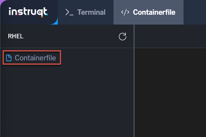

Welcome to this lab experience for Red Hat Enterprise Linux.

The system displayed beside this text is a Red Hat Enterprise Linux 9 system registered with Subscription Manager.

Image mode uses standard container tools to define, build, and transport bootc images. Podman has already been installed on this host as a build environment, along with some additional files and required images.

> [!NOTE]
> If you see an error related to authentication like the one below, you can use the `reglogin` command provided to log into the Red Hat Container Registry and re-run the command.

```nocopy
Please login to the Red Hat Registry using your Customer Portal credentials.
```

Examine the containerfile
===
Switch to the [button label="Containerfile" background="#ee0000" color="#c7c7c7"](tab-1) tab.

Click on `Containerfile`.



Image mode uses standard Containerfiles for defining the OS contents.

1. The `FROM` line defines the base image, in this case our new `bootc` base images, not a typical UBI application base image.
2. The `ADD` line allows us to add the complete contents of a directory at once, just like an application container.
3. The `RUN` directives add software and start services, just like an application container.

Unlike an application container, we're using `systemctl` to enable the service rather than an `ENTRYPOINT` or a `CMD` directive. These images will become hosts, so these configuration directives used by container engines for launching processes don't apply. We will have `systemd` running as PID1 once booted.


Once you are done examining the Containerfile, click on the [button label="Terminal" background="#ee0000" color="#c7c7c7"](tab-0) tab.

Examining the configurations added
===

To mimic version controlled configuations, we have a local set of files we want to add to `/etc` on the host to affect system configuration. Let's have a quick look at one of those.
```bash,run
cat etc/sudoers.d/wheel
```

We're using a drop-in file to apply a NOPASSWD rule to the `wheel` group. This is just one example of how you can set policies or configurations within an image build.
```nocopy
%wheel  ALL=(ALL)   NOPASSWD: ALL
```

Build and push the container to the registry
===

Image mode uses OCI standard container tools to build bootc images, like any other application container. Let's build this image with `podman build`.

```bash,run
podman build -t [[ Instruqt-Var key="CONTAINER_REGISTRY_ENDPOINT" hostname="rhel" ]]/test-bootc .
```

Once built, bootc images use OCI standard container registries for distribution. We are using a simple registry in this lab, but enterprise registries will provide ways to inspect contents, history, manage tags and more.

```bash,run
podman push [[ Instruqt-Var key="CONTAINER_REGISTRY_ENDPOINT" hostname="rhel" ]]/test-bootc
```

This is really all that is needed for a simple web server! We can add any common administrative or application software to our images, just like any other RHEL host. Let's see how we move from build to deploy in the next exercise.
