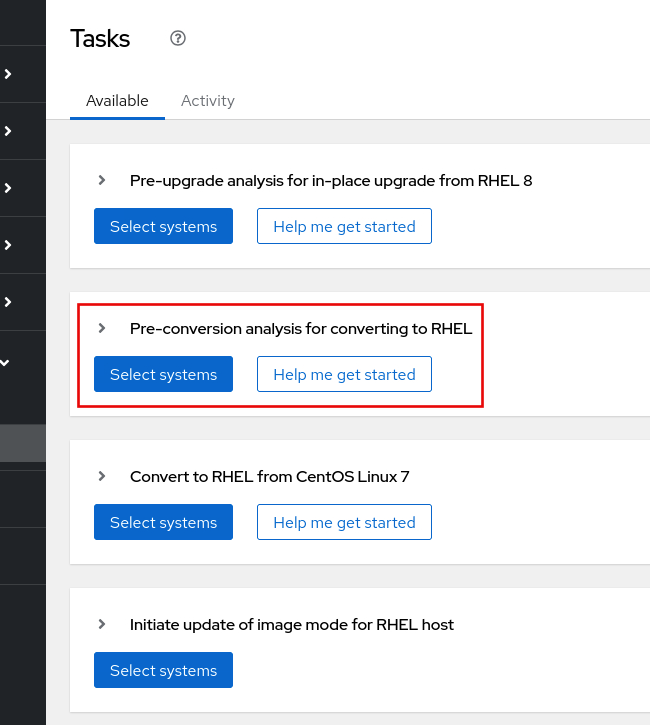
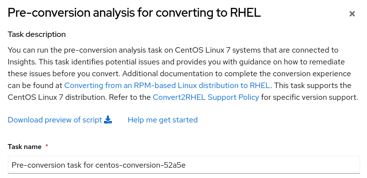
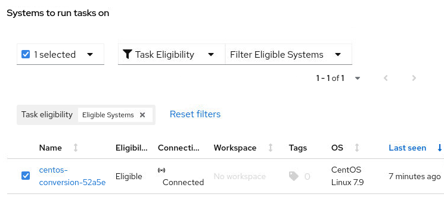
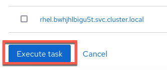
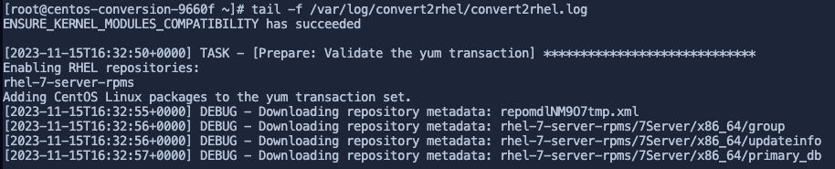
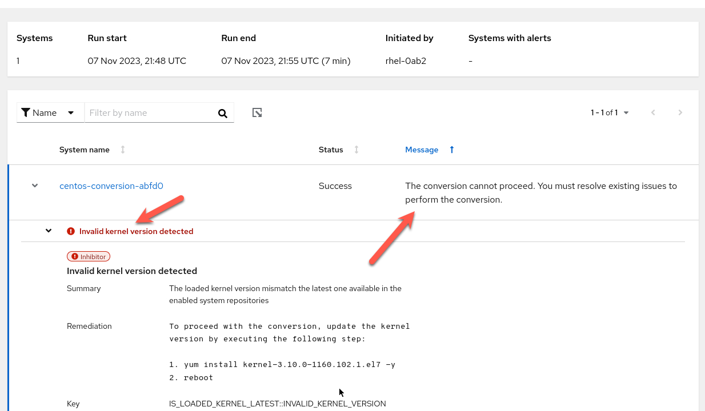

In this first part of the lab, we'll perform a pre-conversion analysis with Insights. In subsequent steps of this lab, we'll perform the convert2rhel operation.

# What is Convert2RHEL?

Convert2RHEL is a command line utility that allows for self-service migration between RHEL-like distributions to officially supported Red Hat Enterprise Linux instances.

The convert2rhel tool handles subscribing the target system to your Red Hat customer account while maintaining customizations, configurations, and workloads.

Convert2RHEL is also a supported operation which means if you run into issues with the conversion process, you can open a ticket with Red Hat Support.

# What is the Insights pre-conversion analysis?

To assess whether your CentOS Linux systems can be converted to RHEL, run the Pre-conversion analysis for converting to RHEL task. The preconversion analysis generates a report that summarizes potential problems and suggests recommended solutions. The report also helps you decide whether it is possible or advisable to proceed with the conversion to RHEL.

Please see the official Red Hat documentation on pre-conversion analysis in Insights, [here](https://access.redhat.com/documentation/en-us/red_hat_enterprise_linux/8/html-single/converting_from_an_rpm-based_linux_distribution_to_rhel/index#proc_preparing-for-a-rhel-conversion-using-insights_converting-using-insights).

Install the client tools
===========================

Copy and paste the command below into the centos terminal. This command will download the Red Hat GPG key.

```
curl -o /etc/pki/rpm-gpg/RPM-GPG-KEY-redhat-release https://www.redhat.com/security/data/fd431d51.txt
```

Next, configure your host repositories to download Red Hat client tools. These tools are required to connect to console.redhat.com so that we can run the pre-conversion analysis.

```
curl -o /etc/yum.repos.d/client-tools.repo https://ftp.redhat.com/redhat/client-tools/client-tools-for-rhel-7-server.repo
```

Install the required client tools packages. These include `rhc`, `rhc-worker-script`, and `insights-client`.

```
yum -y install subscription-manager rhc rhc-worker-script insights-client
```

Run the client tools
====================

Now we'll run a couple commands that will enable use to run the pre-conversion analysis from Red Hat Insights. The command below registers the host to Red Hat Subscription Manager with the activation key `convert2rhel`. Next the command connects enables Remote Host Configuration with `rhc-connect`. The `insights-client --register` registers the system with Insights.

```
subscription-manager register --org 12451665 --activationkey convert2rhel && rhc connect && insights-client --register

```

Here's what the output should look like.


For more information on these commands see the following documentation:
- [subscription-manager](https://access.redhat.com/solutions/253273)
- [rhc](https://access.redhat.com/articles/rhc)
- [insights-client](https://access.redhat.com/documentation/en-us/red_hat_insights/2023/html/client_configuration_guide_for_red_hat_insights/index)

Log into Red Hat Insights
=========================

Now we'll log into Red Hat Insights.


1) Click on the tab labelled `Red Hat Insights`
2) Enter the following Red Hat login.
```
rhel-0ab2
```
3) Enter the following password.
```
Redhat1!
```

<!-- Enable `Preview on`.

 -->

Run the pre-conversion task
===========================
Navigate to RHEL tasks.


1) In the search bar, enter the following.
```
rhel tasks
```
2) Click on `RHEL Tasks`

In the `Tasks` menu, click `Run task` in the `Pre-conversion analysis for converting to RHEL` menu.



Copy the string below, which contains the CentOS host name. This value varies between lab instances and is not necessarily what is shown below in the screenshot.

```
Pre-conversion task for [[ Instruqt-Var key="vmid" hostname="host" ]]
```

Paste this string into the `Task name` field.



Next, select your host [[ Instruqt-Var key="vmid" hostname="host" ]].

__If the host does not appear you may have to wait a minute or two and retry the `Pre-conversion analysis` task.__



Then click `Execute task`.



Once you click on `Execute task`, a message is sent to the `rhc` service running on the centos host telling it there is a job waiting for it to download and execute. The centos host downloads the job from Red Hat Insights where it installs `convert2rhel` and runs the `Pre-conversion analysis` task. Once that task is complete, a message is sent back to Insights with the status and the results of the task.

Checking the status of the task
===============================

There are 2 ways to check on the status of the task. The first is to read the `convert2rhel` logs on the `centos` host. The second is to view the status of the task in Insights.

To view the `convert2rhel` logs, enter the following in the cli of the `centos` host.

```
tail -f /var/log/convert2rhel/convert2rhel.log
```


To view the status of the task in Insights, click on the `Activity` tab.


Click on the task you created. The name of the task is
```
Pre-conversion task for [[ Instruqt-Var key="vmid" hostname="host" ]]
```


At this point the task is still running and may take about 10 minutes to complete.


Periodically click on the refresh button of the virtual browser to see if the task has finished.


When the task has finished, you can view the results by clicking on the successfully completed task.


Expand the task to view the inhibitors.


The inhibitors may vary. In this case the kernel is too old.



Please proceed to the next step.
