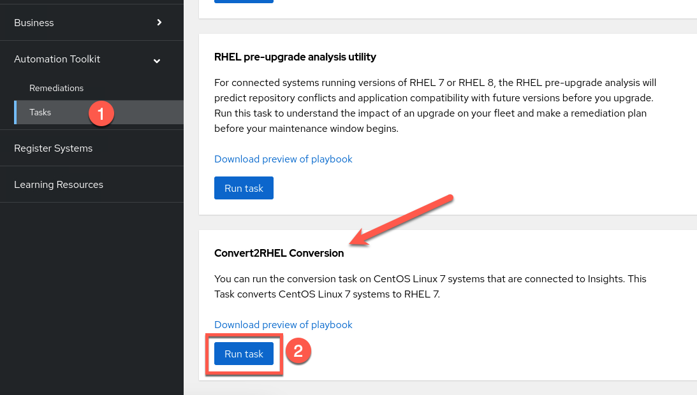
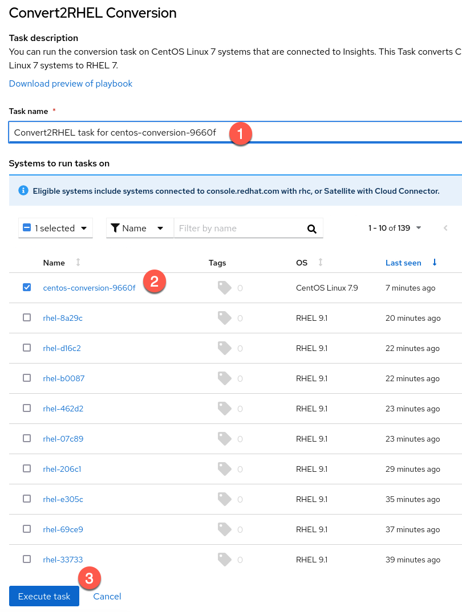
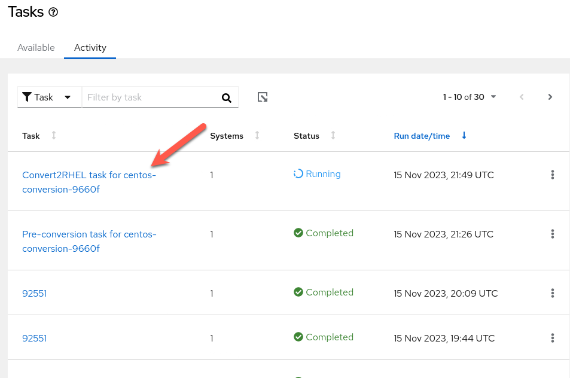

Run the Convert2RHEL conversion task
====================================
<!-- Enable `Preview on`.

 -->

Run the Convert2RHEL conversion task.



1. Click on `Tasks` under `Automation Toolkit`.
2. Under `Convert2RHEL`, click `Run task`.

Configure the task the following way.



1. Give your task the following name
```
Convert2RHEL task for [[ Instruqt-Var key="vmid" hostname="host" ]]
```
2. Select the host `[[ Instruqt-Var key="vmid" hostname="host" ]]`.
3. Click `Execute task`.

The conversion takes around 15 minutes to complete.

Checking the status of the task
===============================

Just as in the first challenge of this lab, there are 2 ways to check on the status of the task. The first is to read the `convert2rhel` logs on the `centos` host. The second is to view the status of the task in Insights.

To view the `convert2rhel` logs, enter the following in the cli of the `centos` host.

```
tail -f /var/log/convert2rhel/convert2rhel.log
```


To view the status of the task in Insights, click on the `Activity` tab.


Click on the task you created. The name of the task is
```
Convert2RHEL task for [[ Instruqt-Var key="vmid" hostname="host" ]]
```



The conversion takes around 15 minutes to complete.


Periodically click on the refresh button of the virtual browser to see if the task has finished.


When the task has finished, you can view the results by clicking on the successfully completed task.
