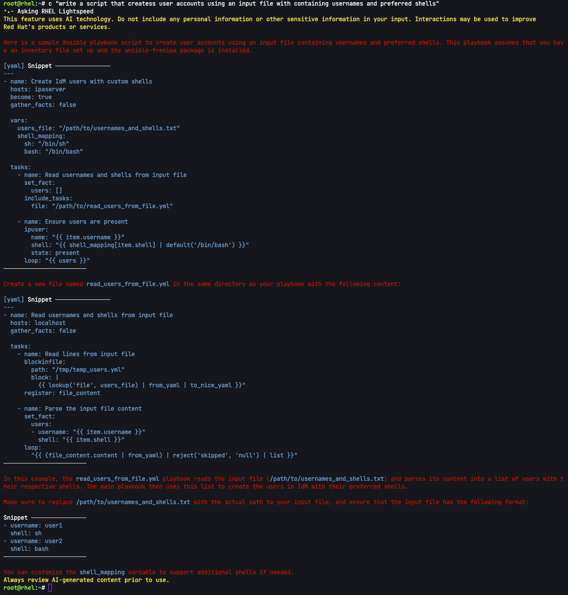

It may be the case that you will have to perform a repetitive task, such as creating user accounts, at least once in your life. Command Line Assistant can help you reduce the burden of such a task.

Users
===
In this challenge we've provided a comma separated value (csv) file containing usernames and preferred terminal shells.

You can take a look here.
```bash,run
cat ~/users.csv
```

We'll ask CLA to create a shell script to take the file `users.csv` as input and create users with their preferred shells.

Create the script
===
It's important to be very specific when asking CLA to write any sort of code. For exmample, we'll run the following request.
```bash,run
c "write a script that creates user accounts using an input file with containing usernames and preferred shells"
```

Here's the result.


CLA returned an ansible playbook (and a pretty elaborate one at that).

Let's try that again.
```bash,run
c "Write a shell script that creates user accounts. The script should accept a csv file as an argument. The csv file contains the fields username,shell"
```
