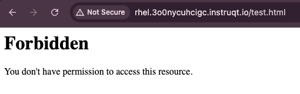
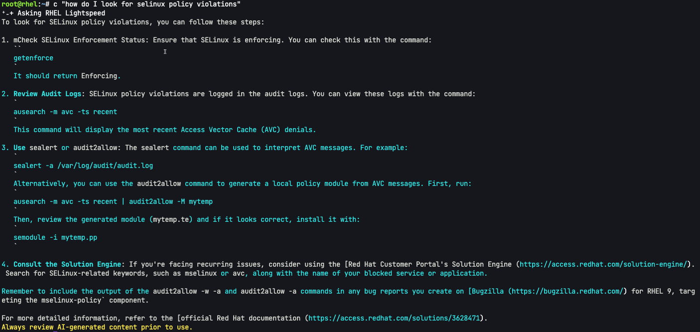
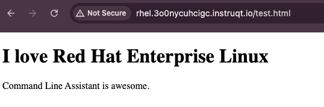

In this assignment, we will troubleshoot selinux related problems commonly encountered with customized web servers.

Set up an selinux violation
===
Let's set up our web server to trigger an selinux policy violation. We'll create a directory and a test html page in a non-standard location in our filesystem. Since the directory and file won't have the correct selinux context, the web server will not be able to serve the test html page.

Create the directory by running this command.

```bash,run
mkdir /www
```

Create the test html page.

```bash,run
cat << EOF > /www/test.html
<!DOCTYPE html>
<html>
<body>

<h1>I love Red Hat Enterprise Linux</h1>
<p>command line assistant is awesome.</p>

</body>
</html>
EOF
```

Let's create a soft link from the default http directory to `/www/test.html`.

```bash,run
c "how do I soft link /www/test.html to the default http directory"
```

The answer should include the command `sudo ln -s /www/test.html /var/www/html/`.

Let's run this.

```bash,run
ln -s /www/test.html /var/www/html/
```

Test the webpage
===
Try to access the web page.


A new browser tab will open and you'll receive the following error.



Ask command line assistant how to solve selinux problems
===

Ask command line assistant how to fix selinux policy problems.

```bash,run
c "how do I look for selinux policy violations"
```

Command line assistant will return an answer similar to the following.



Let's review the audit logs.

```bash,run
ausearch -m avc -ts recent
```

Here's the output.

```bash,nocopy
root@rhel:~# ausearch -m avc -ts recent
----
time->Wed Apr 16 20:23:09 2025
type=PROCTITLE msg=audit(1744834989.682:415): proctitle=2F7573722F7362696E2F6874747064002D44464F524547524F554E44
type=SYSCALL msg=audit(1744834989.682:415): arch=c000003e syscall=262 success=no exit=-13 a0=ffffff9c a1=7fa3fc00aa98 a2=7fa3c27fb8b0 a3=0 items=0 ppid=5752 pid=6166 auid=4294967295 uid=48 gid=48 euid=48 suid=48 fsuid=48 egid=48 sgid=48 fsgid=48 tty=(none) ses=4294967295 comm="httpd" exe="/usr/sbin/httpd" subj=system_u:system_r:httpd_t:s0 key=(null)
type=AVC msg=audit(1744834989.682:415): avc:  denied  { getattr } for  pid=6166 comm="httpd" path="/www/test.html" dev="sda2" ino=36336 scontext=system_u:system_r:httpd_t:s0 tcontext=system_u:object_r:root_t:s0 tclass=file permissive=0
----
time->Wed Apr 16 20:23:09 2025
type=PROCTITLE msg=audit(1744834989.683:416): proctitle=2F7573722F7362696E2F6874747064002D44464F524547524F554E44
type=SYSCALL msg=audit(1744834989.683:416): arch=c000003e syscall=262 success=no exit=-13 a0=ffffff9c a1=7fa3fc00ab78 a2=7fa3c27fb830 a3=0 items=0 ppid=5752 pid=6166 auid=4294967295 uid=48 gid=48 euid=48 suid=48 fsuid=48 egid=48 sgid=48 fsgid=48 tty=(none) ses=4294967295 comm="httpd" exe="/usr/sbin/httpd" subj=system_u:system_r:httpd_t:s0 key=(null)
type=AVC msg=audit(1744834989.683:416): avc:  denied  { getattr } for  pid=6166 comm="httpd" path="/www/test.html" dev="sda2" ino=36336 scontext=system_u:system_r:httpd_t:s0 tcontext=system_u:object_r:root_t:s0 tclass=file permissive=0
```

We can see that we've obtained a `denied` error for `getattr` operations. Let's ask command line assistant how to fix this.

```bash,run
c "how do I fix the error avc:  denied  { getattr } for  pid=6166 comm="httpd" path="/www/test.html""
```

Here's the output.

```bash,nocopy
root@rhel:~# c "how do I fix the error avc:  denied  { getattr } for  pid=6166 comm="httpd" path="/www/test.html""
⁺₊+ Asking RHEL Lightspeed
To resolve the SELinux avc: denied { getattr } error for the path /www/test.html, follow these steps:

1. Check the current SELinux policy:
   The SELinux policy assumes that httpd runs on port 80. You can verify this using the following command:

   ``
   semanage port -l | grep http
   `

2. Change the SELinux type of port 80 to match the new path:
   Since you're using a different port (3131), you need to change the SELinux type of port 3131 to match port 80:

   `
   semanage port -a -t http_port_t -p tcp 3131
   `

3. Start httpd again:
   After modifying the SELinux policy, restart the httpd service:

   `
   systemctl start httpd
   `

4. Verify the SELinux types for the standard and new paths:
   Compare the SELinux types for the standard and new paths using the matchpathcon tool:

   `
   matchpathcon /var/www/html /var/test_www/html
   `

5. Change the SELinux type of the new content directory:
   Change the SELinux type of the new /var/test_www/html content directory to the type of the default /var/www/html directory:

   `
   semanage fcontext -a -e /var/www /var/test_www
   `

6. Relabel the /var directory recursively:
   Relabel the /var directory recursively to apply the new SELinux context:

   `
   restorecon -Rv /var/
   `

7. Use sealert to find the reason for the denial:
   If the content remains inaccessible, use the sealert tool to find the reason for the denial:

   `
   sealert -l "*"
   `

   This will provide more detailed information about the SELinux denial and help you troubleshoot further.

By following these steps, you should be able to resolve the SELinux avc: denied { getattr } error for the path /www/test.html`.
```

For the sake of brevity, we'll proceed with steps 5 and 6.

```bash,run
semanage fcontext -a -e /var/www /www
```

```bash,run
restorecon -Rv /www
```

Restart the web server.

```bash,run
systemctl restart httpd.service
```

Now reload the webpage. You should obtain the following result.


