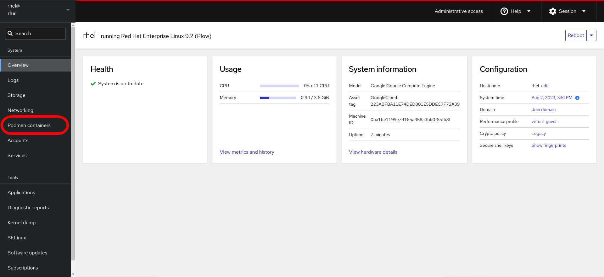
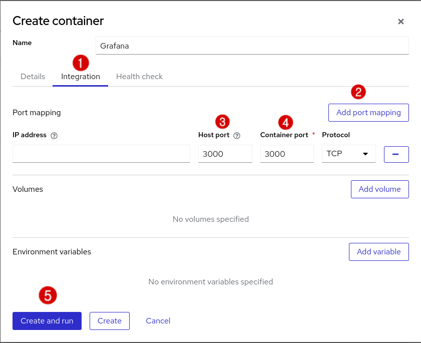

In this step, you will configure Podman containers through the RHEL web console. This gives you a graphical view of your containers and can help you customize your containers more simply.

First, click on the `RHEL Web Console` tab.

Next, log in with the following credentials:
>* Username: rhel
>* Password: redhat

After logging in, click on the button in the web console labeled `Enable administrative access`.

Next, enter the password (`redhat`) and click `Authenticate`

In the menu on the left side of the web console, select `Podman containers`

From here, you can manage [containers and pods](https://developers.redhat.com/blog/2019/01/15/podman-managing-containers-pods). Click `Create container` to create your Grafana container.

In the `Details` tab of the `Create container` dialog, enter the following details:
* Name: Grafana
* Image: docker.io/grafana/grafana

Next, click on the `Integration tab`, select `Add port mapping`, enter 3000 as the value for `Host port`, enter 3000 as the value for `Container port`, and then select `Create and run`.

Wait about 30 seconds for the container to run. You may need to refresh the page to update the container status. Once the container state is `running`, click on the Grafana (Podman) tab in the lab environment.