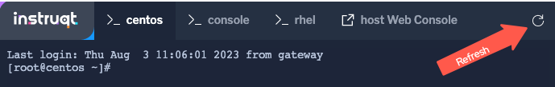

## Understanding the Convert2RHEL command

There are several different combinations of arguments that can be used to execute the conversion process. The main factor is registering your new RHEL system with an active subscription. Your choices are:

1) Fully interactive session: answer questions and input username and password as part of the conversion

2) Including your username and password in the convert2rhel command. This is less desireable since your Red Hat customer portal credentials would then be stored in the server's Bash history in plain text.

3) Including your organization ID and Activation Key as part of the command. This is more secure, however, finding your org-id and creating an activation key are outside the scope of this lab.

## Running the Convert2RHEL analyze utility

<pre class='file'>
convert2rhel --org < ORG ID > --activationkey  < KEY >
</pre>

In order to automate this process as much as possible, you will kick off the conversion analysis using the activation key combination from #3 above:

```bash,run
convert2rhel analyze --org 12451665 --activationkey convert2rhel

```

>**Note:** This process will take some time!

<pre class='file'>
# convert2rhel analyze --org 12451665 --activationkey convert2rhel -y

[07/22/2022 18:40:54] TASK - [Prepare: Show Red Hat software EULA] ******************************
The following text is a copy of the November 18, 2019 version of Red Hat GPLv2-Based End User License Agreement (EULA) [1].
For up-to-date version of the EULA, visit [2].
[1] https://www.redhat.com/licenses/Red_Hat_GPLv2-Based_EULA_20191118.pdf
[2] https://www.redhat.com/en/about/agreements

... output truncated ...

Package                                                  Vendor/Packager  Repository
-------                                                  ---------------  ----------
epel-release-7-14.noarch                                 Fedora Project   /epel-release-latest-7.noarch
google-compute-engine-oslogin-20220714.00-g1.el7.x86_64  N/A              google-compute-engine
google-guest-agent-20220713.00-g1.el7.x86_64             N/A              google-compute-engine
google-compute-engine-20220211.00-g1.el7.noarch          N/A              google-compute-engine
gce-disk-expand-20200716.00-g1.el7.x86_64                N/A              google-compute-engine
google-osconfig-agent-20220711.00-g1.el7.x86_64          N/A              google-compute-engine
google-cloud-sdk-396.0.0-1.x86_64                        N/A              google-cloud-sdk

</pre>

You'll be asked to confirm several the process at several steps. Type a `y` and hit enter to continue the process.

## Reviewing the analysis

When the analysis process is complete, you will noticed a couple of errors. The `Error` refers to an out of date kernel. This is listed as an error and shown in red beacuse the conversion has a much higher level of risk. The report even provides you the steps needed to correct this issue.

<pre class='file'>
========== Error (Must fix before conversion) ==========
(ERROR) IS_LOADED_KERNEL_LATEST::INVALID_KERNEL_VERSION - Invalid kernel version detected
     Description: The loaded kernel version mismatch the latest one available in the enabled system repositories
     Diagnosis: The version of the loaded kernel is different from the latest version in the enabled system repositories.
     Latest kernel version available in updates: 3.10.0-1160.108.1.el7
     Loaded kernel version: 3.10.0-1160.102.1.el7
     Remediation: To proceed with the conversion, update the kernel version by executing the following step:

    1. yum install kernel-3.10.0-1160.108.1.el7 -y
    2. reboot
</pre>

To remediate this issue, enter the following command:

```bash,run
yum update -y && reboot
```

The terminal will lose connection with the centos host leaving the message `exited`.


You can reconnect the session in the `centos` tab if desired. Refresh the `centos` tab until you are reconnected.



> [!NOTE]
> Optional: Once your system is back from its reboot, you may re-run the analyze command to see the results after fixing the kernel version.