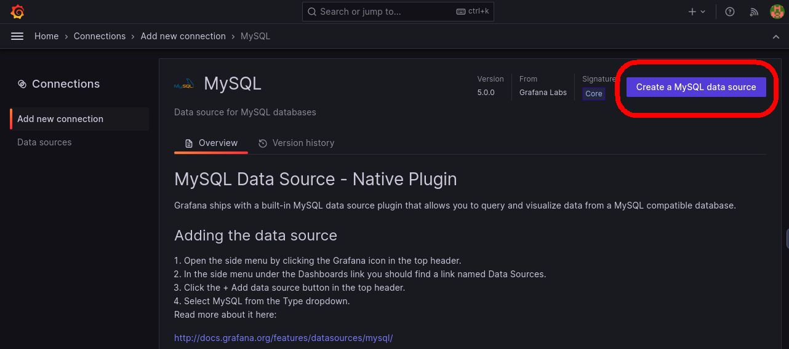
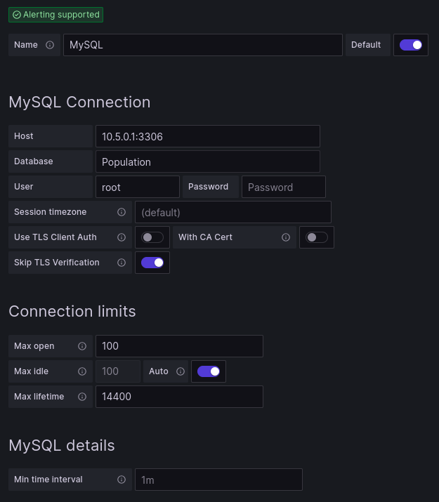
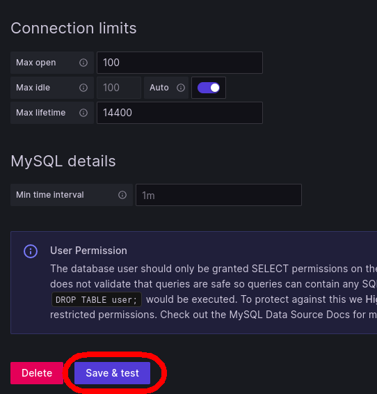

Click on the `Grafana` tab in the lab environment. You can now explore this website hosted on your machine. If you see a login page, you have configured your container correctly.

Log in using the default credentials:
>* Username: admin
>* Password: admin

You may be prompted to change the login credentials. You can press the `skip` button on that dialog box if you wish.

You are now ready to configure Grafana for data visualization.

A MySQL database has been configured for you. This SQL Database contains data on the population of Singapore from 1950 to 2022. You will make a time-series visualization of that data within Grafana, showing the change in population over 72 years.

First, connect Grafana to the MySQL database. To get started, click the menu button in the upper-left of Grafana, and then click `Connections`.

Next, click on the `Add new connection` tab, type `mysql` into the search bar, and click on the MySQL button.

Click on `Create a MySQL data source`

When prompted with a configuration dialog box, use these settings:

Finally, click `Save & test` to finish configuring your connection to MySQL

In the next step, you will configure a data dashboard using this MySQL database of Singaporean population data.
