In this step, you will visualize the data from your MySQL database.

Switch to the `Grafana (Podman)` tab of the lab environment.

First, Click the menu button in the upper-left of Grafana, and then click `Dashboards`.
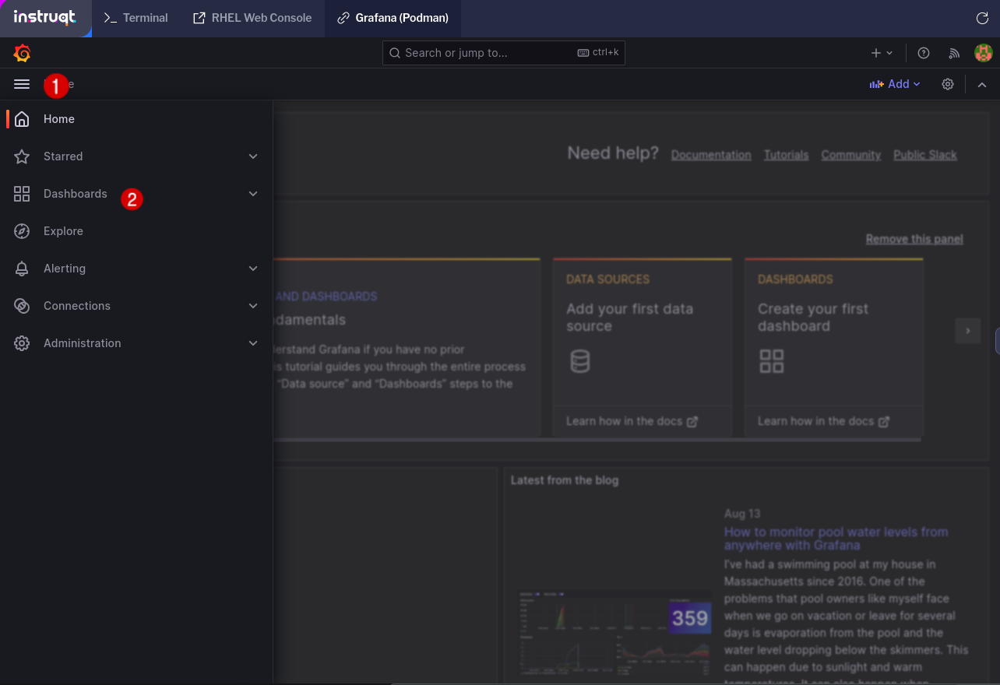

Next, click `New` then click `New Dashboard`.
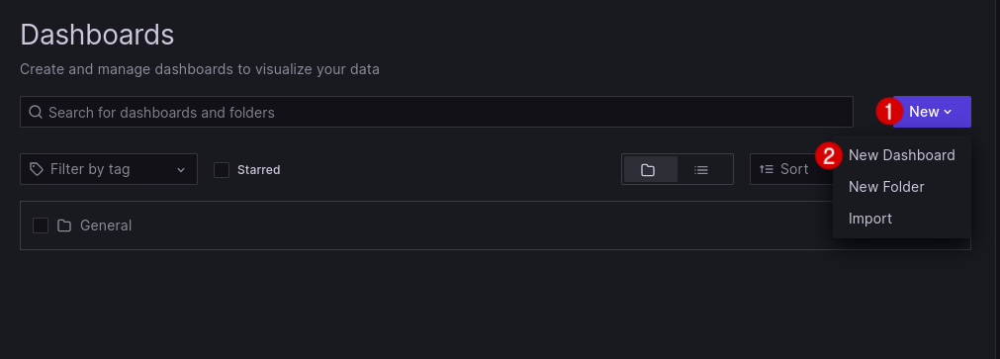

Click on `Add Visualization`

Select MySQL as your data source.
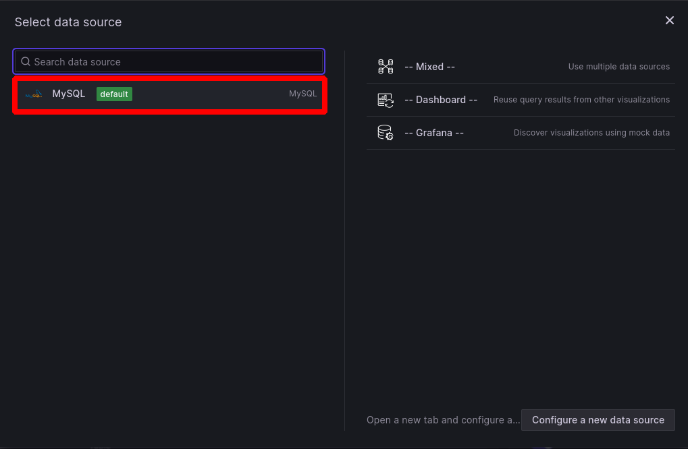

You will now see a blank dashboard editor.
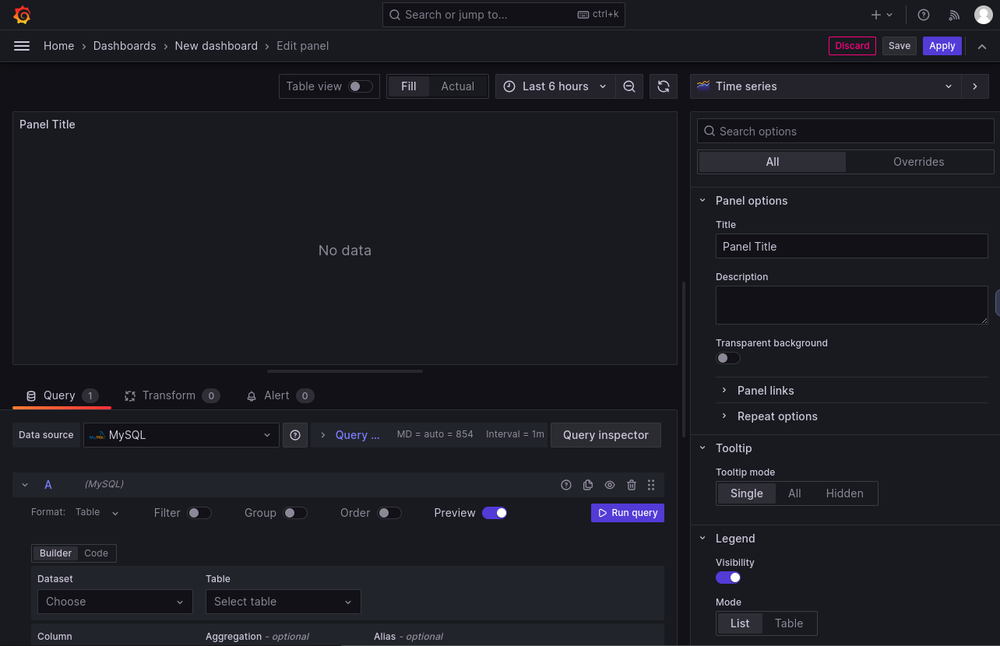

In the query section, select the following options:
* Format: `Table`
* Filter: Disabled
* Group: Disabled
* Order: Disabled
* Preview: Enabled
* Dataset: `Population`
* Table: `Singapore_Population`
* Column: `*`

Here is what that configuration means:
* The format is set to `Table` because our SQL data is formatted as a table.
* `Population` is the name of the MySQL database you are accessing
* Within the `Population` database, you are importing data from a table called `Singapore_Population`
* The `*` selection for column indicates that you are importing all columns.
* The Aggregation and Alias sections can be left blank as we are not transforming our data in this lab.

After selecting the query options, click `Run query` and then click `Zoom to data`.
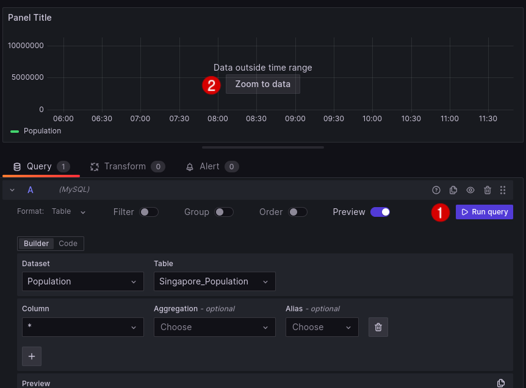

You will now see a graph of Singapore's population from 1972-2022.
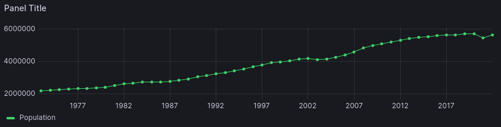

However, our database contains data from 1950-2022, so we want Grafana to query all of the data, not just the first 50 entries. To edit your SQL query, click on `Code` in your query configuration options:
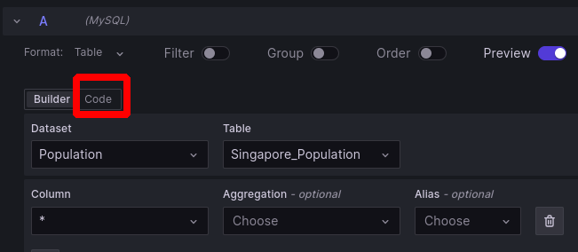

From the code editor, remove the part that says  `LIMIT 50`, and then click on `Run query`
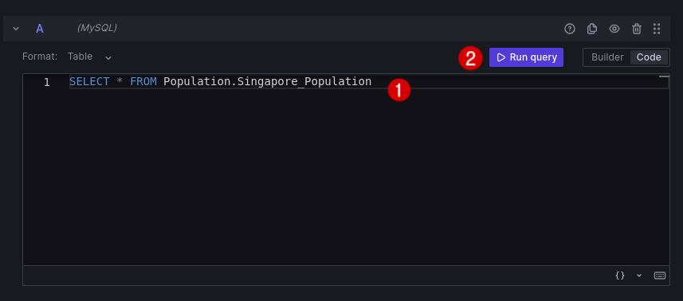

Now Grafana is querying all of our data, but there is still one problem. We need to adjust the scale of our graph so we can see the output. Click on the time range above the graph and enter the following settings for the absolute time range:
* From: `1950-01-01 00:00:00`
* To: `2022-01-01 00:00:00`

Next, click `Change time settings` and select `Coordinated Universal Time` from the drop-down box. Then click `Apply time range` to apply your selections.
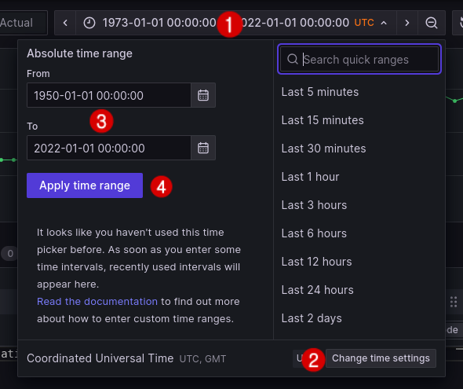

Now, you will see all of your data in the graph.
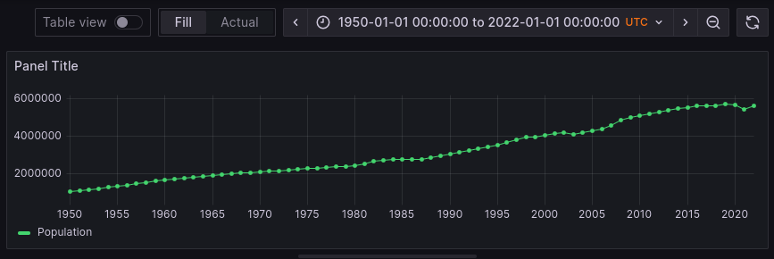

Enter a title for your graph and then click `save` to save your graph.
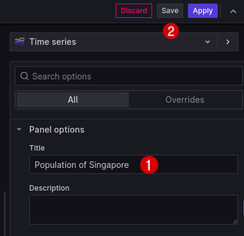

Finally, when prompted, enter a name for your dashboard and click `save`.

You will now see your data dashboard!
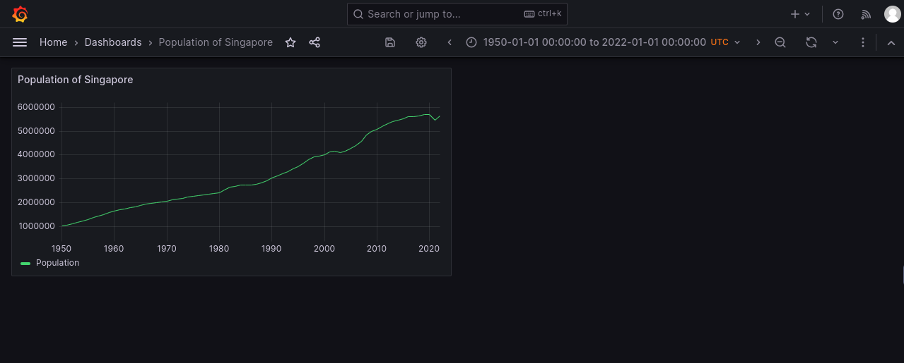
