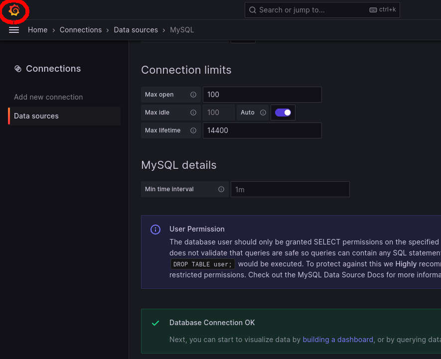

In this step, you will visualize the data from your MySQL database.

Switch to the `Grafana (Podman)` tab of the lab environment.

First, return to Grafana's home screen by clicking on the Grafana logo in the upper-left side of the window.

Click the menu button in the upper-left of Grafana, and then click `Dashboards`.

Next, click `New` then click `New Dashboard`.

Click on `Add Visualization`
