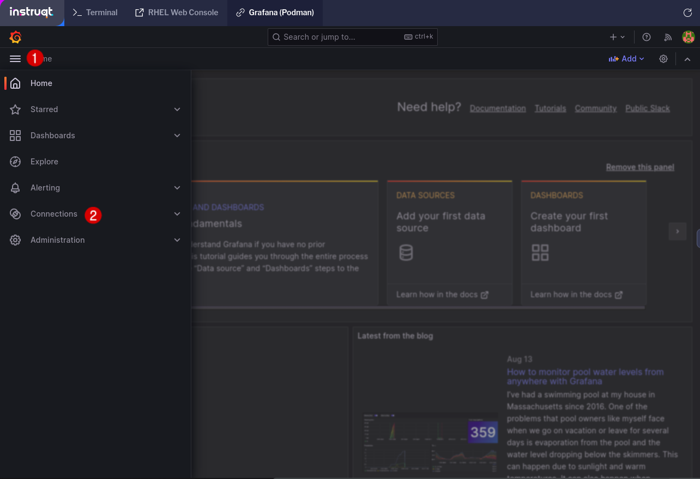
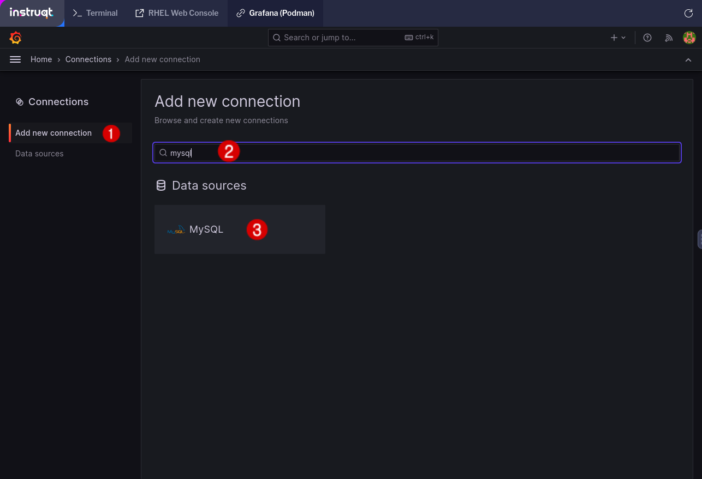

In this step, you will configure Grafana for data visualization.

Switch to the `Grafana (Podman)` tab of your lab environment.

A MySQL database has been configured for you. This SQL Database contains data on the population of Singapore from 1950 to 2022. You will make a time-series visualization of that data within Grafana, showing the change in population over 72 years.

First, connect Grafana to the MySQL database. To get started, click the menu button in the upper-left of Grafana, and then click `Connections`.

Next, click on the `Add new connection` tab, type `mysql` into the search bar, and click on the MySQL button.

