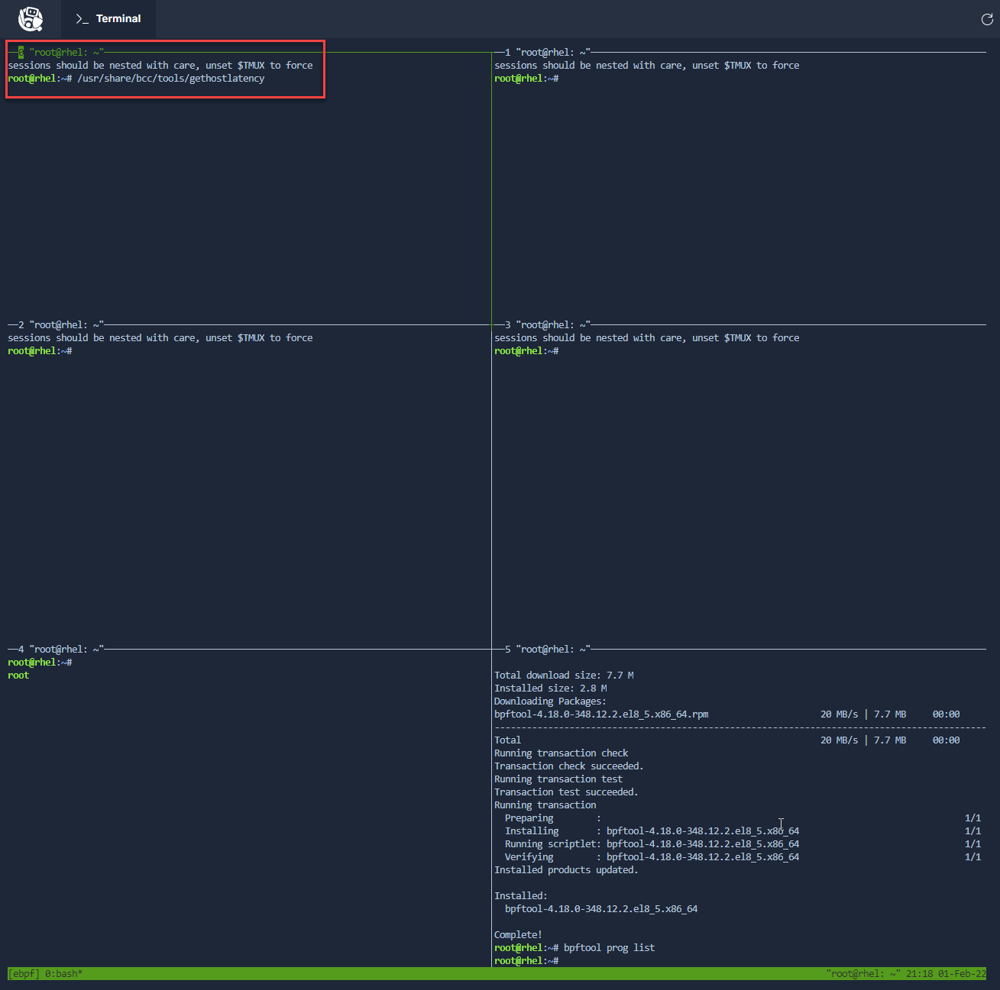

In this step, you will start running the bcc-tools to prepare for observing an active workload on the system.  In the lab environment there are several additional terminal tabs across the top of the interface, the names correspond to tools that you will run in this, and following steps.

First, you will validate the environment and that it is not currently using any eBPF calls.  To do this, you will install the `bpftool` utility.

In __pane 5__, run the following command.

```bash
yum install -y bpftool
```

Next, run `bpftool` to verify that no eBPF programs are currently loaded in the kernel.  If there are no eBPF programs in use, the tool will return no output.

```bash
bpftool prog list
```

The tool should have provided no output, indicating that no eBPF tools are running in the environment.

Now, launch some bcc-tools applications in the separate, provided terminals. You will use these to observe our sample workload in a following step.

Start by running `gethostlatency` in the __pane 0__ terminal (type Ctrl-b and the arrow keys to change focus to pane 0.):



```bash
/usr/share/bcc/tools/gethostlatency
```

You should see the following header in __pane 0__ in the terminal,
indicating the tool is properly running:

<pre class="file">
TIME      PID    COMM                  LATms HOST
</pre>

In __pane 0__ in the terminal, you are running the `gethostlatency` bcc-tool. It is showing latency statistics on the `getaddrinfo()` and `gethostbyname()` system calls. Effectively, you get to see how long these system calls take and which hostnames the applications need IP addresses for. This can be useful for discovering network connections that your applications are making.

Next, run `tcplife` in __pane 1__ in the terminal:

```bash
/usr/share/bcc/tools/tcplife
```

The following header should now be displayed in the *tcplife* terminal, indicating the tool is running:

<pre class="file">
PID   COMM       LADDR           LPORT RADDR           RPORT TX_KB RX_KB MS
</pre>

`tcplife` will tell you data about established tcp connections. PID is the process ID of the process opening the connection.  COMM, the command that corresponds to the PID.  LADDR and LPORT reference the local address and port of the connection. RADDR and RPORT the remote address and port.  TX_KB and RX_KB are the amount of data Transmitted (in Kilobytes) and Received (in Kilobytes).  MS is the time of the connection, in milliseconds.

In the next step, you will continue to start additional bcc-tools applications in the lab environment to start collecting additional data.
