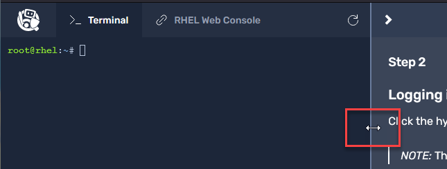
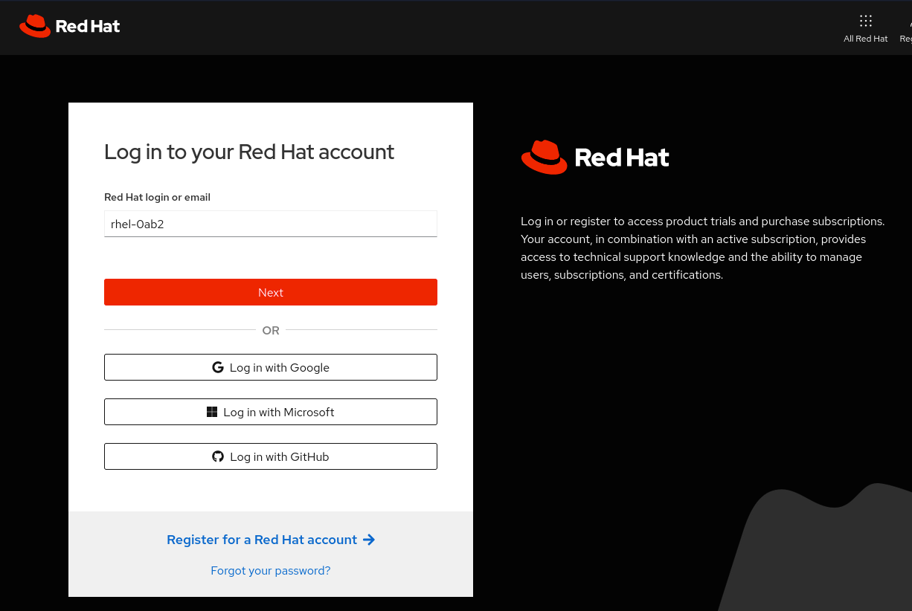

In this lab, we will introduce the usage of Red Hat Edge Management.
>_NOTE:_ To make the inline images larger, expand this window. 

 First, let's access the hybrid cloud console.

Click the hyperlink or browse to [cloud.redhat.com/edge/fleet-management](https://console.redhat.com/edge/fleet-management) to access Red Hat's software as a service web portal.

>_NOTE:_ This will open an additional browser window or tab.

Click the _Log in to your Red Hat account_ button.



Login using the credentials below:

Login

```bash
rhel-0ab2
```

Password

```bash
Redhat1!
```
