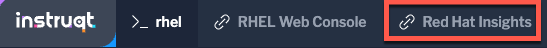

In this lab, we will introduce the usage of Red Hat Edge Management.

First, let's access Red Hat Insights.

Click on the `Red Hat Insights` tab.



You'll be taken to the the login screen to https://console.redhat.com.


Login using the credentials below:

Login

```bash
rhel-0ab2
```

Password

```bash
Redhat1!
```

Proceed to the next step of this lab.
