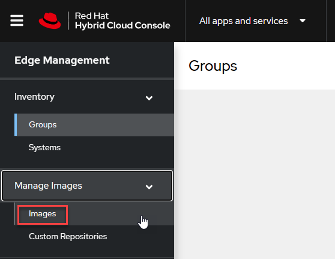
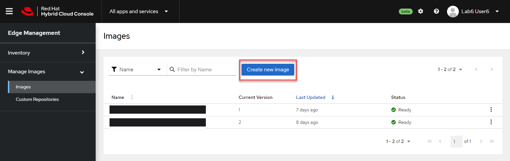
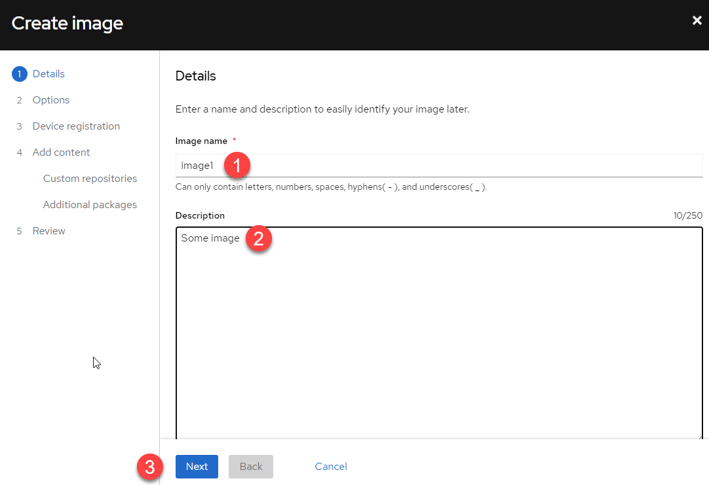
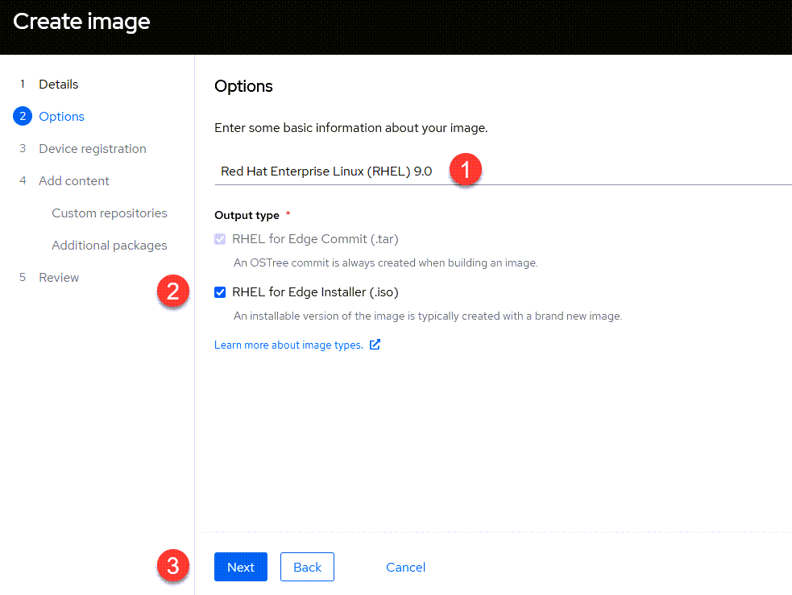
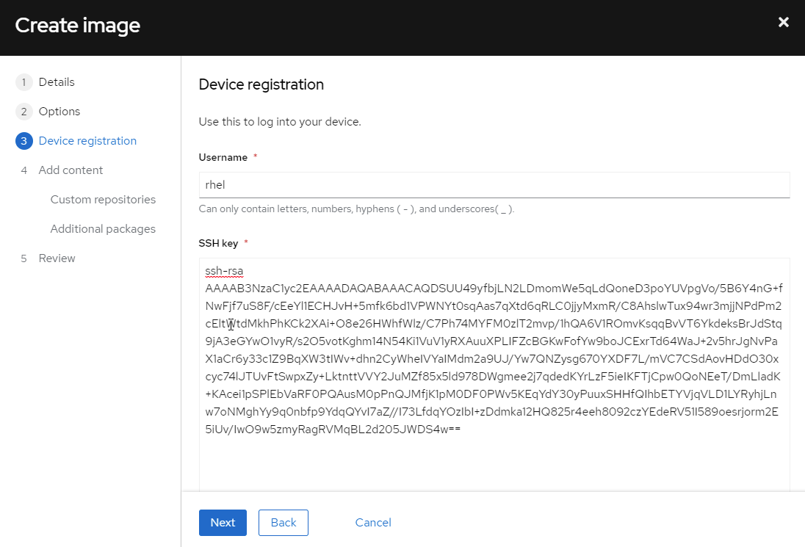
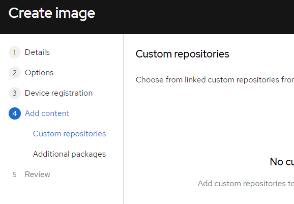
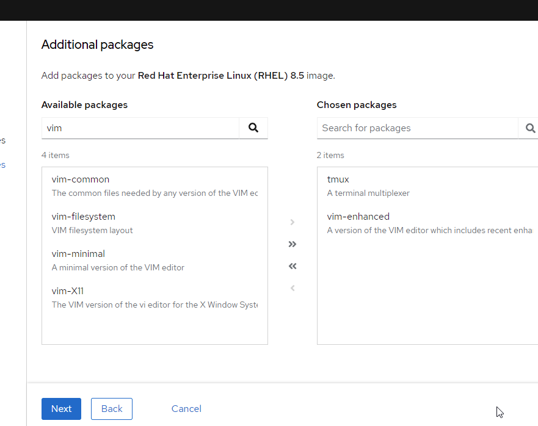
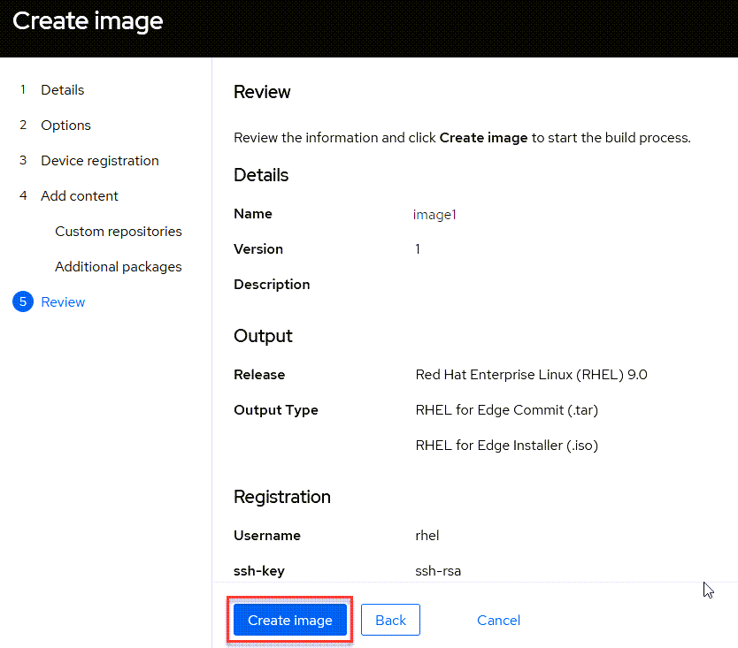
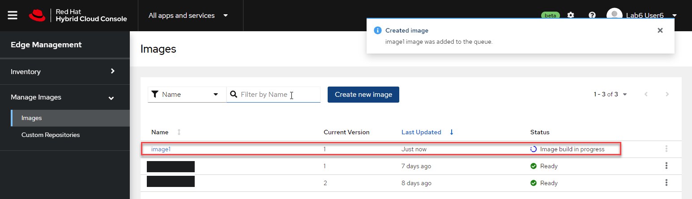

We'll create an operating system image to install on our edge device.

Navigate to the `Images` menu.



Click `Create new image`.



1) Give your image a name.
2) Enter a description
3) Click `Next`.



1) Ensure the Red Hat Enterprise Linux (RHEL) 9 is selected.
2) Make sure RHEL for Edge Installer (.iso) is checked.
3) Click `Next`.



Use the following credentials for logging into the edge device.

Username

```bash
rhel
```

Public SSH key

```bash
ssh-rsa AAAAB3NzaC1yc2EAAAADAQABAAACAQDSUU49yfbjLN2LDmomWe5qLdQoneD3poYUVpgVo/5B6Y4nG+fNwFjf7uS8F/cEeYl1ECHJvH+5mfk6bd1VPWNYt0sqAas7qXtd6qRLC0jjyMxmR/C8AhslwTux94wr3mjjNPdPm2cEltWtdMkhPhKCk2XAi+O8e26HWhfWlz/C7Ph74MYFM0zlT2mvp/1hQA6V1ROmvKsqqBvVT6YkdeksBrJdStq9jA3eGYwO1vyR/s2O5votKghm14N54Ki1VuV1yRXAuuXPLIFZcBGKwFofYw9boJCExrTd64WaJ+2v5hrJgNvPaX1aCr6y33c1Z9BqXW3tIWv+dhn2CyWheIVYaIMdm2a9UJ/Yw7QNZysg670YXDF7L/mVC7CSdAovHDdO30xcyc74lJTUvFtSwpxZy+LktnttVVY2JuMZf85x5ld978DWgmee2j7qdedKYrLzF5ieIKFTjCpw0QoNEeT/DmLladK+KAcei1pSPlEbVaRF0PQAusM0pPnQJMfjK1pM0DF0PWv5KEqYdY30yPuuxSHHfQIhbETYVjqVLD1LYRyhjLnw7oNMghYy9q0nbfp9YdqQYvI7aZ//I73LfdqYOzIbI+zDdmka12HQ825r4eeh8092czYEdeRV51I589oesrjorm2E5iUv/IwO9w5zmyRagRVMqBL2d205JWDS4w==
```



Click `Next`.

Skip the custom repositories.



In the `Additional packages` menu, add `tmux` and `vim-enhanced` to the image.



Click `Next`.

Click `Create image`.



The image creation process will take about 15 minutes to complete. Refresh this page to update the status.


