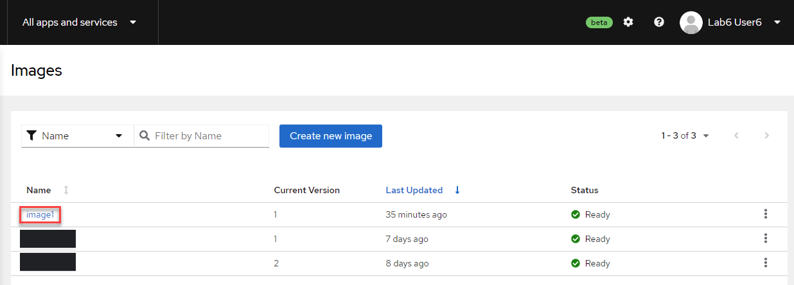
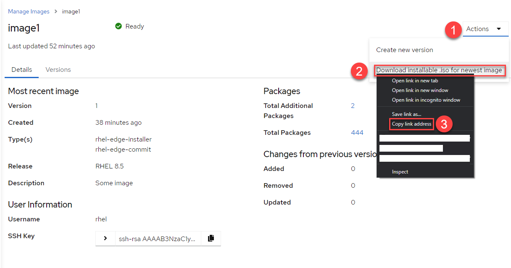
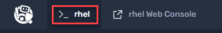
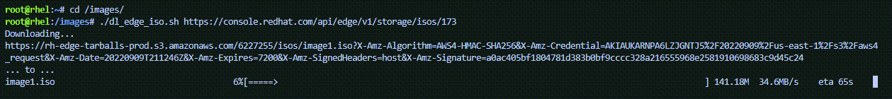
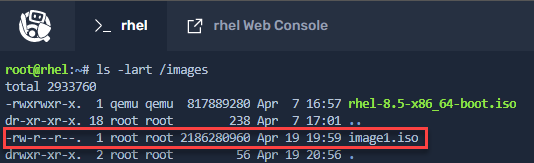

Now that the image has been created, we'll download it to the RHEL host in the lab so that we can install it in a VM (which we can consider to be our edge device).

Click on the image we just created.



1) On the image menu click on `Actions`.
2) Right-click on `Download installable .iso for newest image`.
3) Click on `Copy link address`.



Click the `rhel` tab in the Instruqt lab webpage.



Change into the `images` directory.

```bash
cd /images
```

Due to the limitations of the lab environment, you will download the edge install iso with a specially created script.

Enter the following command.

```bash
./dl_edge_iso "<copied URL>"
```

The image download will begin.



Check that the image is located in the directory `/images`.


