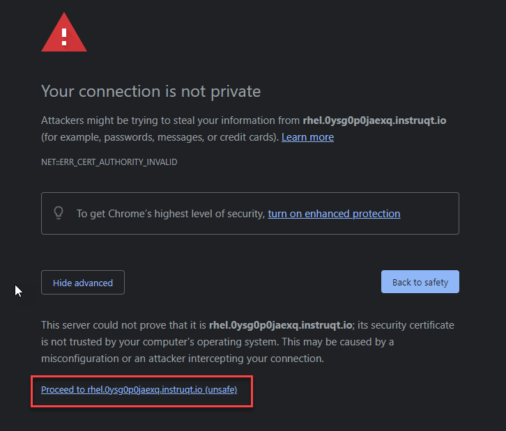
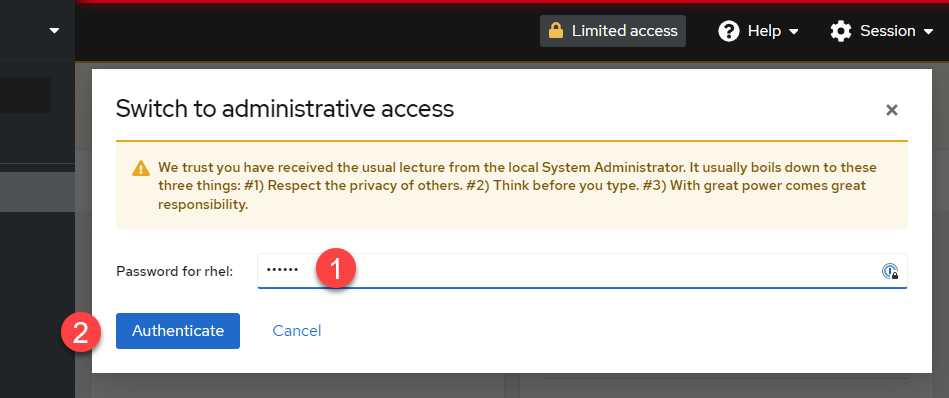
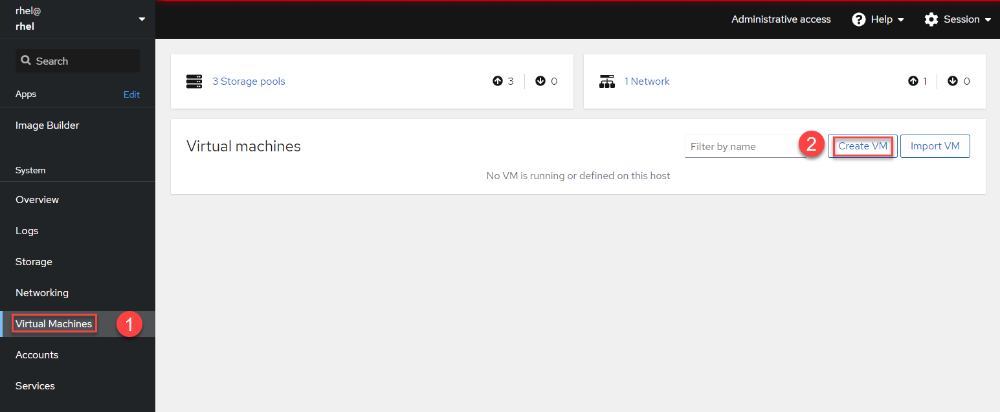
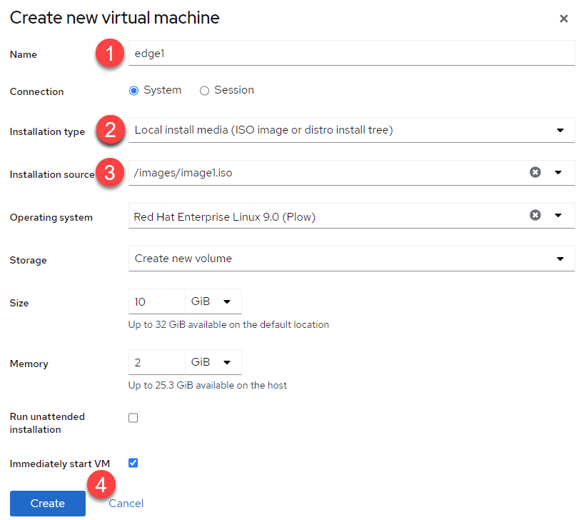
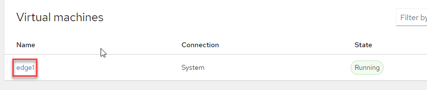
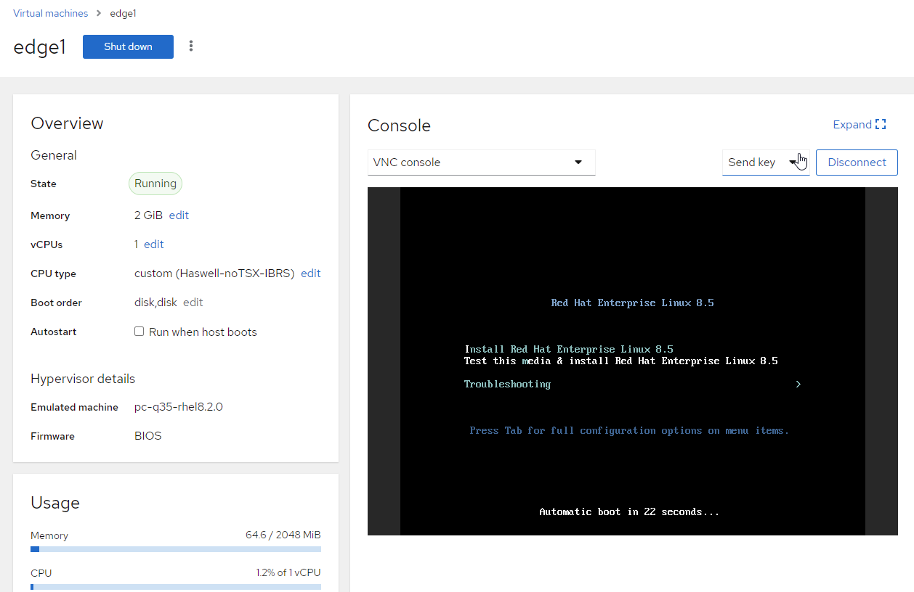
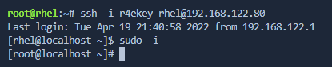
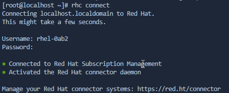
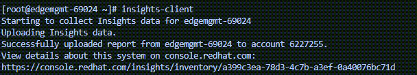
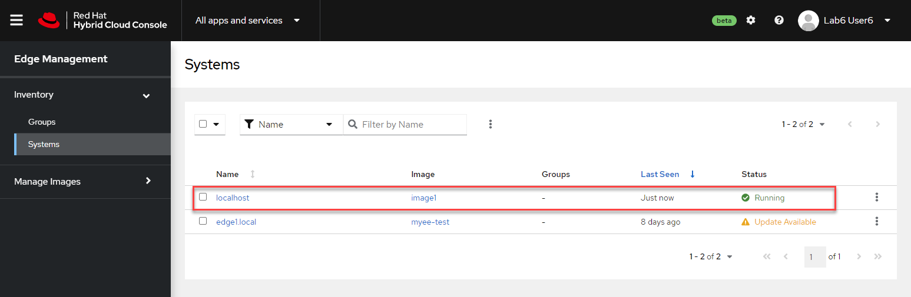

We are now ready to install the image. In this lab, we'll use the built in RHEL hypervisor, libvirtd to create an edge device or VM.

First, log into the web console for the RHEL host.

Click on the tab titled **RHEL Web Console** at the top of  your lab system interface. Selecting this tab will open the lab system's Web Console in a
new browser tab or window.


Click `Advanced`


Then click `Proceed to rhel.xxxx.instruqt.io`



Once the login page is presented, use the following credentials to log into the Web Console:

Username: **rhel**\
Password: **redhat**


## Turn on administrative access

Click `Turn on administrative access`.


Next do the following:

1) Enter the password: **redhat**
2) Click `Authenticate`



1) Click on `Virtual Machines`.
2) Click on `Create VM`.



1) Next, name your edge device.
2) Select `Local install media` in the dropdown for installation type.
3) Select `/images/image1.iso` that we just downloaded.
4) Click `Create`.



Click on the name of the vm, in this case `edge1`.



There you'll see the terminal window of the VM and you can watch the automatic installation of the image.



When the installation has completed, go back to the `rhel` terminal and into the edge device. Copy and paste the following.

```bash
imagename=$(virsh -q list | awk '{print $2}')
ip=$(virsh -q domifaddr $imagename | awk '{print $4}' | cut -d/ -f 1)
ssh -i /root/r4ekey rhel@$ip
```



Switch to the root user.

```bash
sudo -i
```

Change the hostname of the edge device to something unique.

```bash
hostnamectl set-hostname edgemgmt-$(uuidgen | cut -c 32-)
```

Connect the edge device with the hybrid cloud management console.

```bash
rhc connect --username rhel-0ab2 --password Redhat1!
```



Now run insights-client.

```bash
insights-client
```


Now go back to the hybrid cloud console and refresh the inventory. It might take up to 5 minutes for the new edge device to show up.


