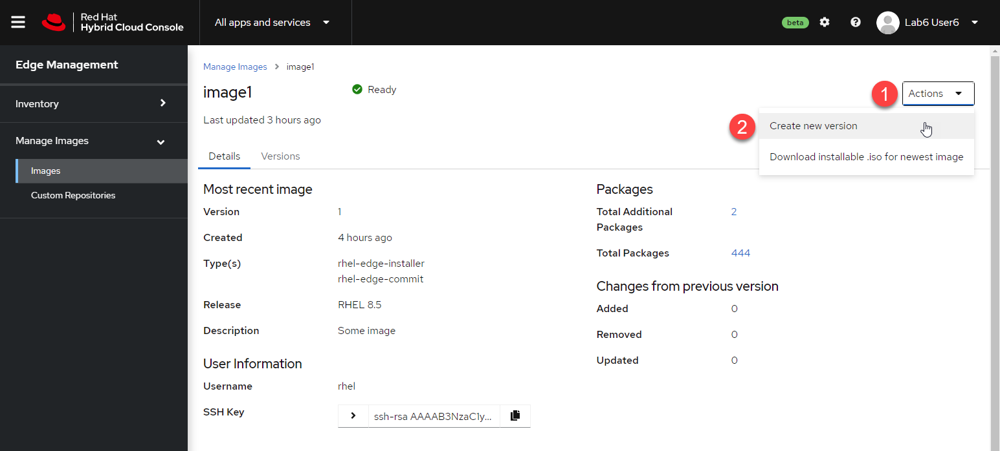
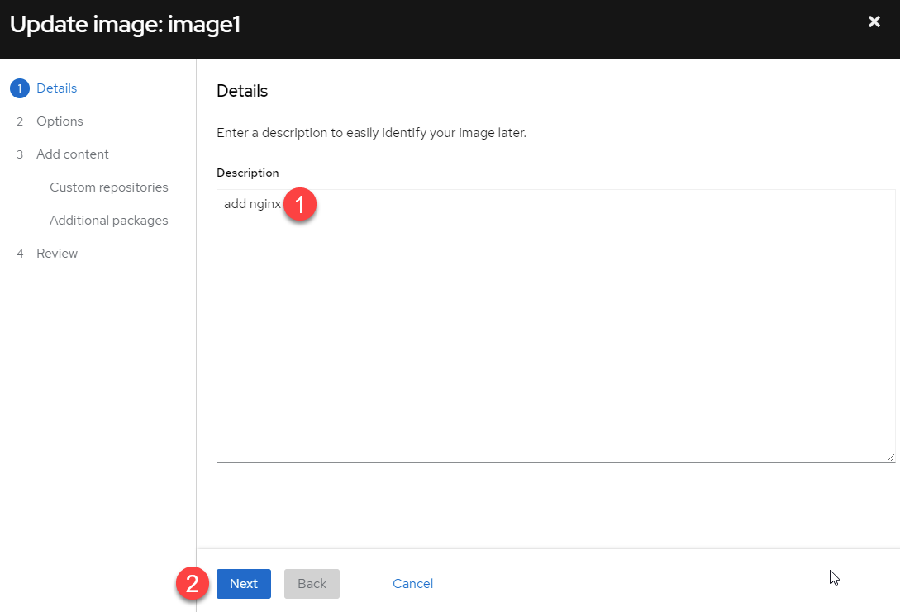
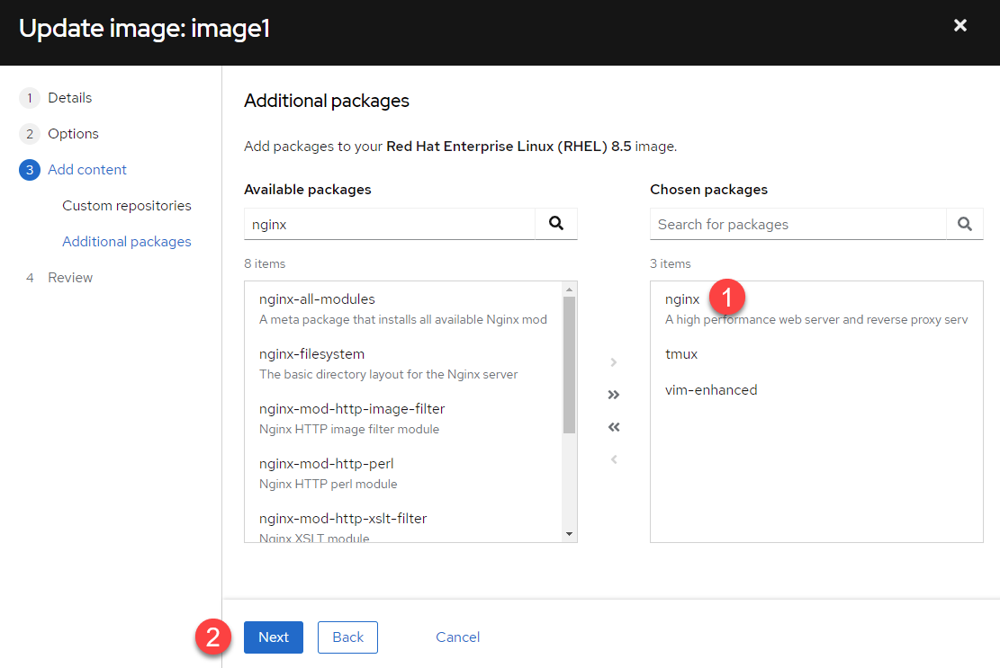
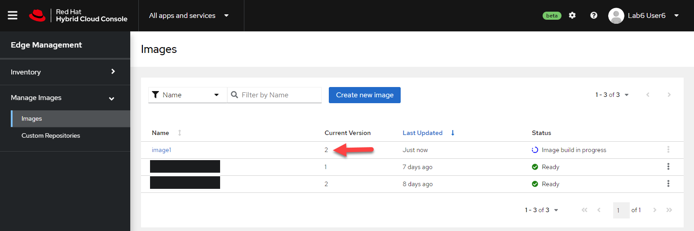
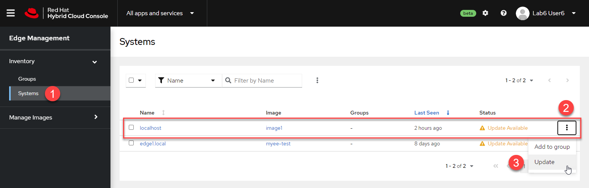
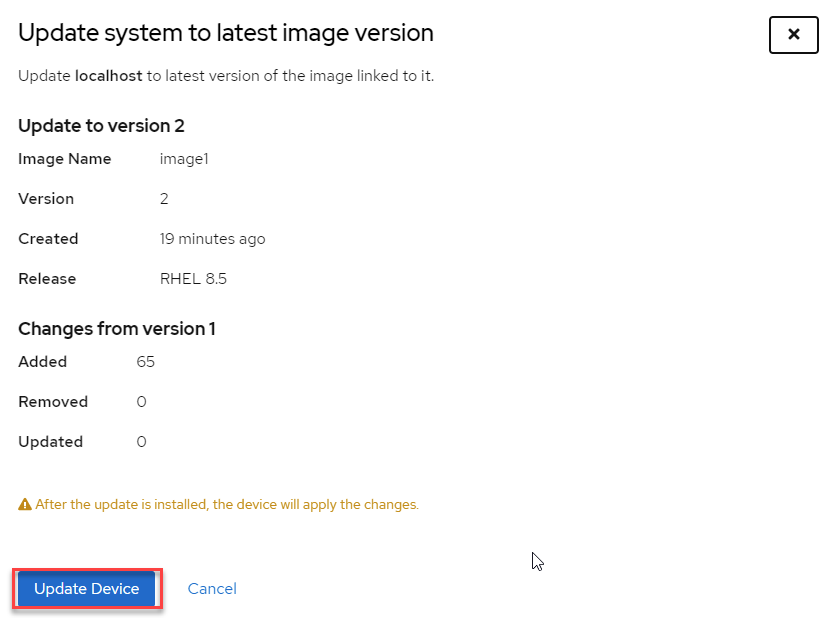
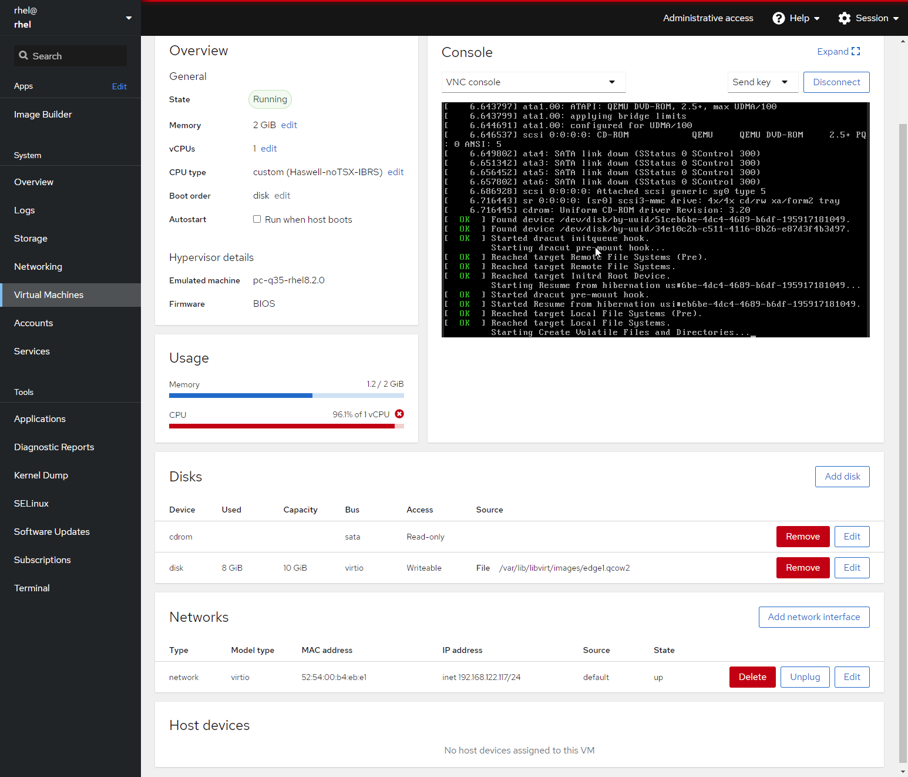
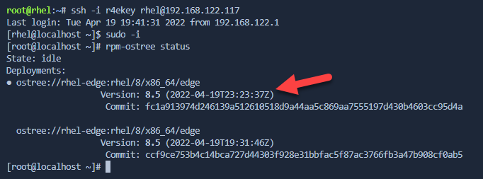
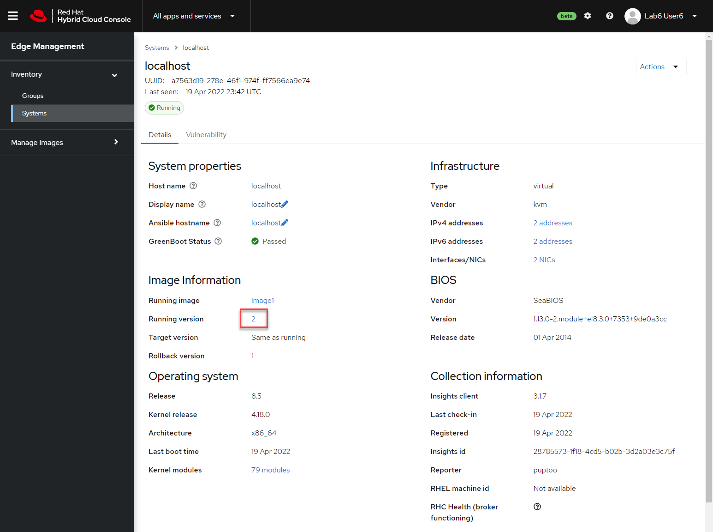

Now we'll update the image and push the updates out to your edge device.

Go back to the hybrid cloud management console and navigate to the image we created.

1) Click on `Actions`.
2) Select `Create new version`.

In this example we'll add `nginx` to the edge device image.

1) Modify the description
2) Click `Next`.

Click through to the `Additional packages` menu.

1) Add the `nginx` package.
2) Click `Next`.

Finally click `Create image` and wait for the image to be created.

Go to the `Images` menu to view the status of the image building process. Notice that the version number has incremented to `2`.

When the image build has completed do the following.

1) Click on the `Systems` menu.
2) Then click on the "kebab" button for the edge device we just installed and click 3) `Update`.

Click `Update Device`.

Go back to the Web Console for the rhel host. You can watch the update run. It might up to 5 minutes before this process begins.

When the edge device completes rebooting,SSH into the edge device from the RHEL terminal and check the running image with the command `rpm-ostree status`.

In the hybrid cloud console, you can see that the edge device is now running version 2 of `image1`.

You may also want to check if the nginx package is installed by entering  `rpm -qa nginx`.
