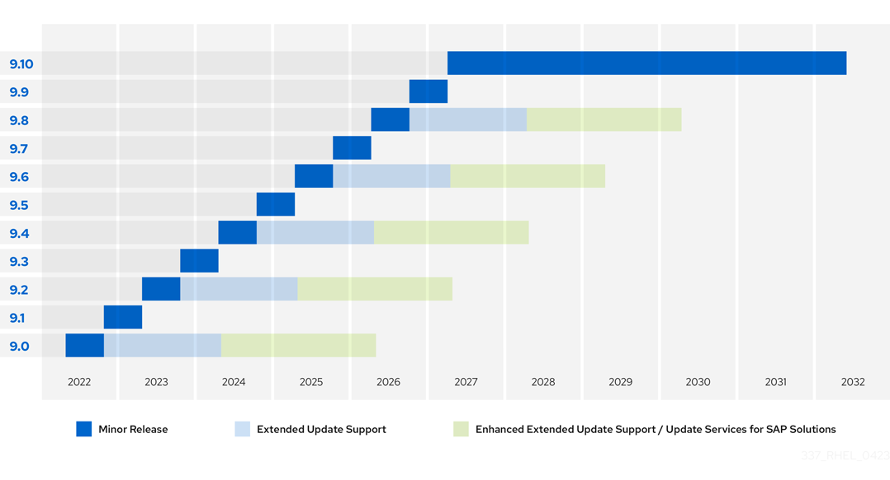

# What is Extended Update Support (EUS)?

EUS is an optional offering for Red Hat Enterprise Linux (RHEL) subscribers. With Extended Update Support, Red Hat provides backports of Critical and Important impact security updates and urgent-priority bug fixes for a predefined set of minor releases of Red Hat Enterprise Linux. EUS enables customers to remain with the same minor release of Red Hat Enterprise Linux for 24 months, allowing for stable production environments for mission-critical applications.

# Why would you use EUS?

Traditional systems administration logic suggests that one would upgrade to the latest release as it becomes available. However, certain workloads or environments may require a more static environment while still maintaining vendor support:

- Some sensitive production workloads may require minimal infrastructure changes.
- Some organizations require the entire application stack be certified with every minor release
- Certain independent software vendors (ISVs) may only certify specific RHEL minor releases.

Red Hat's EUS program enables partners and customers alike to standardize on specific minor versions without the need for orbitrary decisions. Since RHEL 4.5, Red Hat Enterprise Linux has provided EUS. Since RHEL 8.0, the standard for EUS releases is to support *.0 and every even numbered release. (This policy has been upheld for RHEL 9.x as well.)



# Verifying Extended Update Support Availability

Extended Update Support is an offering and therefore requires a subscription to enable the expected functionality. From the OS level, you are able to determine whether a system has the EUS add-on available:

```
subscription-manager repos | grep -i eus

```

<pre class=file>
# subscription-manager repos | grep -i eus
Repo ID:   rhel-9-for-x86_64-sap-solutions-eus-rpms
Repo URL:  https://cdn.redhat.com/content/eus/rhel9/$releasever/x86_64/sap-solutions/os
Repo ID:   rhel-9-for-x86_64-sap-netweaver-eus-debug-rpms
Repo URL:  https://cdn.redhat.com/content/eus/rhel9/$releasever/x86_64/sap/debug
... Output Truncated ...
Repo ID:   rhel-9-for-x86_64-baseos-eus-rpms
Repo URL:  https://cdn.redhat.com/content/eus/rhel9/$releasever/x86_64/baseos/os
... Output Truncated ...
Repo ID:   rhel-9-for-x86_64-appstream-eus-rpms
Repo URL:  https://cdn.redhat.com/content/eus/rhel9/$releasever/x86_64/appstream/os
</pre>

In the following steps, you will look at how to register your system with EUS and upgrade inbetween EUS releases. However, before you subscribe your system to an EUS release, it is important to note which release your system is running. This information is stored in the file `/etc/redhat-release`

```
cat /etc/redhat-release

```

<pre class=file>
Red Hat Enterprise Linux release 9.0 (Plow)
</pre>

