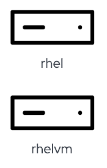
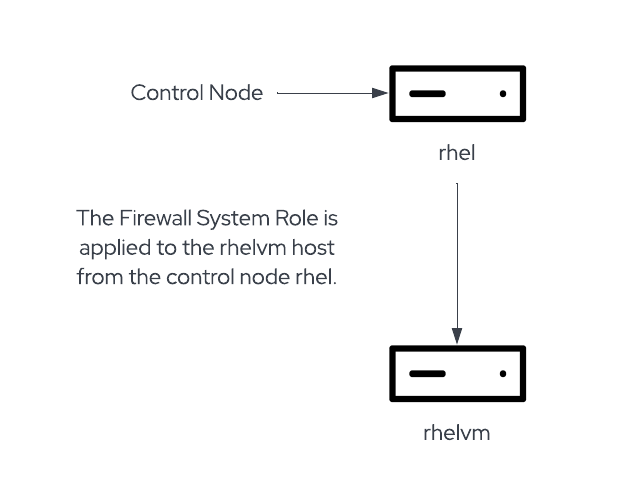

>_NOTE:_ To make the inline images larger, expand this window. 

This lab is composed of two hosts.

In this lab, we will use the host `rhel` as the "control node" or the node where we will install and run the firewall system role. Firewall changes will be applied to `rhelvm`.

We'll perform the following 3 tasks.

1) We will use the firewall system role to open the appropriate port to access web servers on `rhelvm`. This exercise is to show how to open firewall ports by service.

2) As well, we will also use the firewall system role to open port 9999 on `rhelvm` to enable inbound tcp connections. This exercise is to show how to open an arbitrary firewall port.

3) Finally, we'll configure port forwarding from 9999 to port 12345 on `rhelvm`.

>_NOTE:_ In the `rhel` tab in the upper left corner of the Instruqt web page, there are 2 shell sessions launched. To switch between the 2 shell sessions, press Ctrl-B and an arrow key pointing to the session you wish to become active.

Go to the pane containing the `rhel` terminal session. Use ctrl-b + arrow key to swap between the panes.

