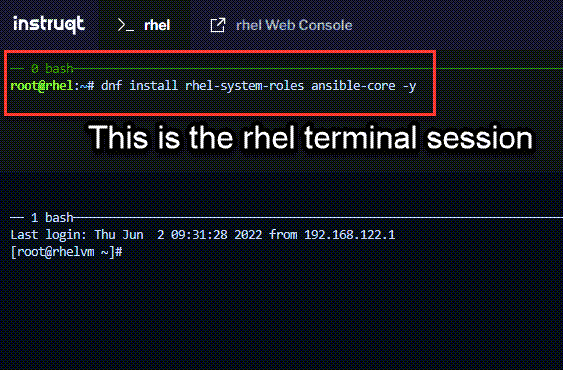

Now we'll install system roles.

Make sure you are in the pane containing the `rhel` terminal session (type `ctrl-b + arrow key` to move between panes).
Enter the following command.

```bash
dnf install rhel-system-roles -y
```



The resulting output will look similar to the output below.


