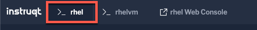
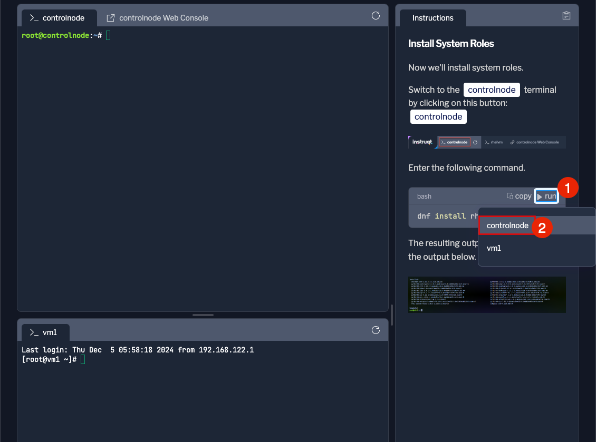
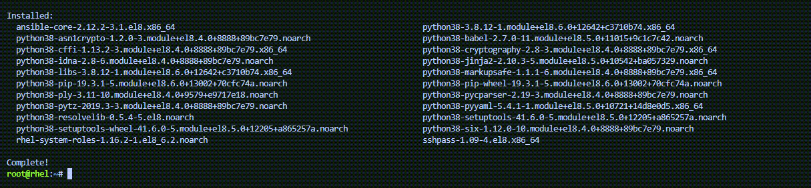

Now we'll install system roles.

Switch to the [button label="controlnode"](tab-0) terminal by clicking on this button: [button label="controlnode"](tab-0)



Enter the following command.

```bash,run
dnf install rhel-system-roles -y
```
> [!NOTE]
> You can click on the `run` button and select the terminal where you wish to run the command.
> 

The resulting output will look similar to the output below.


