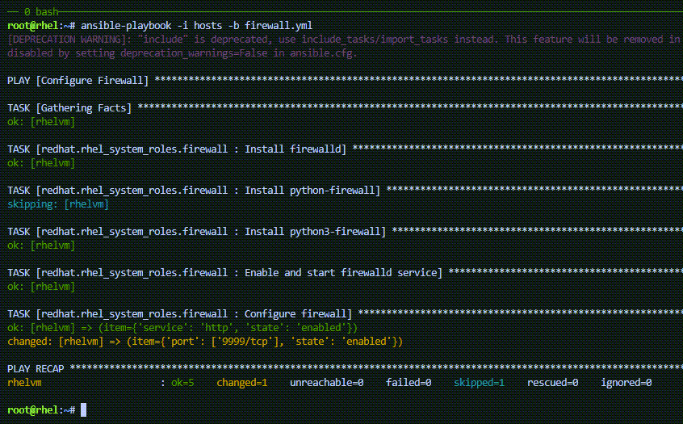
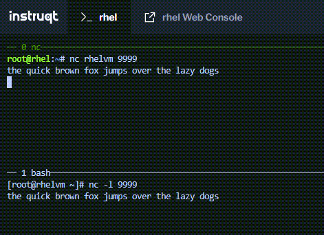

In this challenge we'll open port 9999 on `rhelvm`.

In the `rhel` terminal, add the lines `- port: ['9999/tcp']` and `state: enabled` to the `hosts` file.

<pre>
all:
  hosts:
    rhelvm:
  vars:
    firewall:
      - service: http
        state: enabled
      - port: ['9999/tcp']
        state: enabled
</pre>

The following command will add those lines for you.

```bash
tee -a /root/hosts << EOF
      - port: ['9999/tcp']
        state: enabled
EOF
```

Now run the playbook in the `rhel` terminal.

```bash
ansible-playbook -i hosts -b firewall.yml
```



In the `rhelvm` terminal, run `nc`, listening on port 9999.

```bash
nc -l 9999
```

In the `rhel` terminal, run `nc` and then type some stuff.

```bash
nc rhelvm 9999
```



Type `ctrl-c` to exit `nc`.
