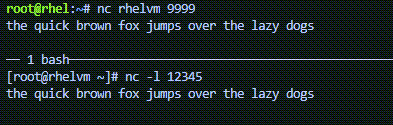

In this challenge we'll forward incoming tcp requests on port 9999 to 12345.

In the `rhel` terminal, add the lines `- forward_port: '9999/tcp;12345;'` and
        `state: enabled`.
        
<pre>
all:
  hosts:
    rhelvm:
  vars:
    firewall:
      - service: http
        state: enabled
      - port: ['9999/tcp']
        state: enabled
      - forward_port: '9999/tcp;12345;'
        state: enabled
</pre>

The following command will add those lines for you.

```bash
tee -a /root/hosts << EOF
      - forward_port: '9999/tcp;12345;'
        state: enabled
EOF
```

Now run the playbook in the `rhel` terminal.

```bash
ansible-playbook -i hosts -b firewall.yml
```

In the `rhelvm` terminal, run `nc`, listening on port 12345.

```bash
nc -l 12345
```

In the `rhel` terminal, run `nc` and then type some stuff.

```bash
nc rhelvm 9999
```



Type `ctrl-c` to exit `nc`.
