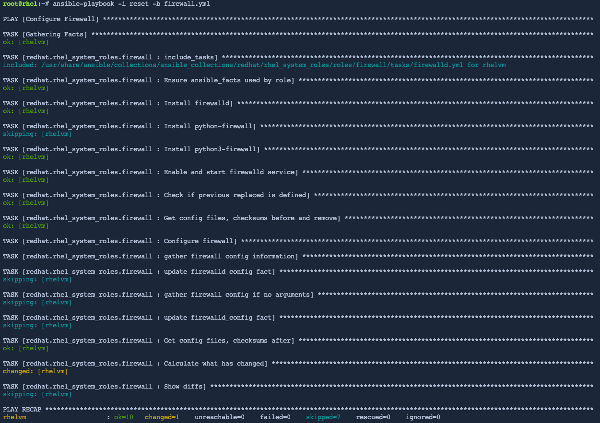

The firewall system role can reset all settings to the default configuration found immediately after Red Hat Enterprise Linux is installed.

We'll reset the firewall configuration in the `rhelvm` host.

First, in the [button label="rhelvm"](tab-1) terminal, list the current rules.

```bash,run
firewall-cmd --list-all
```

<pre>
[root@rhelvm ~]# firewall-cmd --list-all
public (active)
  target: default
  icmp-block-inversion: no
  interfaces: enp1s0
  sources:
  services: cockpit dhcpv6-client http ssh
  ports: 9999/tcp
  protocols:
  forward: yes
  masquerade: no
  forward-ports:
        port=9999:proto=tcp:toport=12345:toaddr=
  source-ports:
  icmp-blocks:
  rich rules:
</pre>

In the [button label="controlnode"](tab-0) terminal, we'll create a new host file called `reset`.

```bash,run
tee -a /root/reset << EOF
all:
  hosts:
    rhelvm:
  vars:
    firewall:
      - previous: replaced
EOF
```

From the [button label="controlnode"](tab-0) terminal, run the playbook to reset the firewall rules on the `rhelvm` host.

```bash,run
ansible-playbook -i reset -b firewall.yml
```



When the playbook as stopped running, switch to the [button label="rhelvm"](tab-1) terminal and check that the firewall rules have been reset.

```bash,run
firewall-cmd --list-all
```

<pre>
[root@rhelvm ~]# firewall-cmd --list-all
public (active)
  target: default
  icmp-block-inversion: no
  interfaces: enp1s0
  sources:
  services: cockpit dhcpv6-client ssh
  ports:
  protocols:
  forward: yes
  masquerade: no
  forward-ports:
  source-ports:
  icmp-blocks:
  rich rules:
</pre>

If you want to apply the rules we created in the previous steps of this lab, simply run `ansible-playbook -i hosts -b firewall.yml` again.
