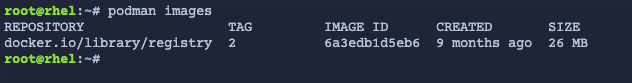

Welcome to this lab experience for Red Hat Enterprise Linux.

The system displayed beside this text is a Red Hat Enterprise Linux 9
system registered with Subscription Manager.

Image mode uses standard container tools to define, build, and transport bootc images. Podman has already been installed on this host as a build environment, along with some additional files.

Examine the containerfile
===

In the [button label="Terminal"](tab-0) tab, run the command below by clicking on `run`.

```bash,run
podman images
```

The output is a listing of the container image stored on the system.



Switch to the [button label="Containerfile"](tab-1) tab.

Click on `Containerfile`.


Image mode relies on standard Containerfiles for defining the OS.

1) The `FROM` line defines the base image.
2) The `ADD` line allows us to add the complete contents of a directory at once.
3) The `RUN` directives add software and start services.


Once you are done examining the Containerfile, click on the [button label="Terminal"](tab-0) tab.

Build the container
===

Build the container like you would any other application container with `podman build`.

```bash,run
podman build -t [[ Instruqt-Var key="REGISTRY" hostname="rhel" ]]/test-bootc .
```

Once the container has been built, we can push it to our registry for distribution. We are using a simple registry in this lab, but enterprise registries will provide ways to inspect contents, history, manage tags and more.


```bash,run
podman push [[ Instruqt-Var key="REGISTRY" hostname="rhel" ]]/test-bootc
```

Inspect the image
===

With the image available in the registry, we can use standard container tools to get information about it. Let's use `skopeo` to get the SHA256 image digest of this image. We will use that later in the lab, so we'll store the output in a file.
```bash,run
skopeo inspect docker://[[ Instruqt-Var key="REGISTRY" hostname="rhel" ]]/test-bootc| jq '.Digest' | tee sha256.orig
```

Launch bootc-image-builder
===

To this point, we've been dealing with standard OCI images and tools. But container images themselves aren't designed to be run outside of a container engine. To run this image as a host, we install it to disk using `bootc`.

For bare metal, we can use Anaconda with `bootc` support to install to disk, but to create a QCOW2 image for a KVM virtual machine we'll use `bootc-image-builder`. This is a containerized version of image builder that includes the bootc tooling to install the container image contents to disk. This can also create other types of disk images like AMIs or VMDKs.

```bash,run
podman run --rm --privileged \
        --volume .:/output \
         --volume ./config.json:/config.json \
        registry.redhat.io/rhel9/bootc-image-builder:latest \
        --type qcow2 \
        --config config.json \
         ${REGISTRY}/test-bootc
```

Let's deploy this disk image using KVM in the next step