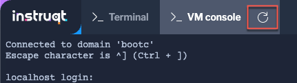

Launch bootc-image-builder
===

To this point, we've been dealing with standard OCI images and tools. However, bootc images are intended to be systems, not run like application containers.

To boot this image as a host, we install it to the filesystem using `bootc`. But `bootc` doesn't know anything about creating disks or machines.

There are several ways to deploy a bootc image to a host, depending on the target environment. For the purposes of this lab, we'll create a QCOW2 image to be run on a KVM virtual machine. To build the QCOW2 image we'll use a tool called `bootc-image-builder`. 

> [!NOTE]
> This operation will take 5 minutes to complete.

```bash,run
podman run --rm --privileged \
        --volume .:/output \
         --volume ./config.json:/config.json \
        registry.redhat.io/rhel9/bootc-image-builder:latest \
        --type qcow2 \
        --config config.json \
         [[ Instruqt-Var key="CONTAINER_REGISTRY_ENDPOINT" hostname="rhel" ]]/test-bootc
```

This tool is a containerized version of image builder that includes the `bootc` tooling to unpack the container image contents to the virtual disk. Supported output formats include AMIs and VMDKs. For bare metal, we can use Anaconda with `bootc` support to install to physical disk. Other typical ways we'd install a RHEL host, like over PXE or HTTP Boot are also available to us. 

Prepare and run the bootc image
===

To launch a KVM guest, copy the QCOW2 disk image we created to the default libvirt storage pool.

```bash,run
cp qcow2/disk.qcow2 /var/lib/libvirt/images/bootc-vm.qcow2
```

Using `virt-install` we can define a simple VM and import the new disk image.

```bash,run
virt-install --name bootc \
 --disk /var/lib/libvirt/images/bootc-vm.qcow2 \
--import \
--memory 2048 \
--graphics none \
--osinfo rhel9-unknown \
--noautoconsole \
--noreboot
```

Once the VM has been defined, we can start it.

```bash,run
virsh start bootc
```

Attach to the console of the VM running our bootc image
===

Next, attach to the console. Switch to the [button label="VM console" background="#ee0000" color="#c7c7c7"](tab-1) tab.

> [!NOTE]
> If the console hasn't connected or there is an error, you can reconnect by clicking Refresh next to the tab name. The prompt will look like this. 

Check the VM is running the applications we installed
===

Once the system has finished booting, you can log in with the following credentials. These were injected by `bootc-image-builder` when creating the disk image. There are several ways to handle user creation and authentication methods, customizing the disk image with `bootc-image-builder` is just one.

In the [button label="VM console" background="#ee0000" color="#c7c7c7"](tab-1) tab, log into the vm with the following credentials.

Username:

```bash,run
core
```

Password:

```bash,run
redhat
```

The initial image included Apache, so let's check on it's status

```bash,run
systemctl status httpd --no-pager
```

The output will look like this.


Let's check if the editor `vim` was installed.

```bash,run
which vim
```


Somehow, we missed installing our standard editor!

Let's add vim to our image in the next step
