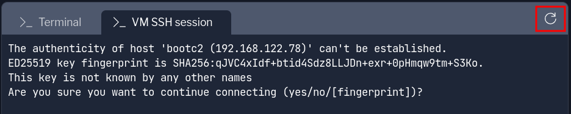

Welcome to this lab experience for Red Hat Enterprise Linux.

The system displayed beside this text is a Red Hat Enterprise Linux 9 system registered with Subscription Manager.

Image mode uses standard container tools to define, build, and transport bootc images. Podman has already been installed on this host as a build environment, along with some additional files.

Let's check on the name of the registry we're using in this lab. During setup, a variable called `REGISTRY` was set.
```bash,run
echo $REGISTRY
```
This is the hostname of the instance in the Terminal.

In a previous lab, we created a virtual machine from a bootc image. That bootc VM was imported intp this lab.

Attach to the console of the VM running our bootc image
===

Let's attach to the console. Switch to the [button label="VM console" background="#ee0000" color="#c7c7c7"](tab-1) tab.

> [!NOTE]
> If the console hasn't connected or there is an error, you can reconnect by clicking Refresh next to the tab name. The prompt will look like this. 

A user was created when the VM was created, you can use the following credentials to log in.

Username:

```bash,run
core
```

Password:

```bash,run
redhat
```

Check the VM is running the applications we installed
===

The initial image included Apache, so let's check on it's status.

```bash,run
systemctl status httpd --no-pager
```

The output will look like this.


Check the image the VM is using
===

Hosts created from bootc images track a particular image in a registry, this is how `bootc` knows when an update is available.

The `spec` section of `bootc status` provides the information about the image in use and where `bootc` is looking for it.
```bash,run
sudo bootc status | grep spec: -A 4
```

Since this VM was created in a different lab, the registry that was used doesn't exist any more. Have we broken our VM?

Switch to a new image
===
Well we can't get updates from that source any more, but we can tell the host to start tracking a new image with `bootc switch`. A new registry with an image that matches the one currently installed is available in this environment.
```bash,run
sudo bootc switch [[ Instruqt-Var key="CONTAINER_REGISTRY_ENDPOINT" hostname="rhel" ]]/test-bootc
```

Like a `bootc update`, switch will download and prepared the new image to a local deployment location on disk. It will then stage that image to become active at the next boot.
```bash,run
sudo bootc status | grep staged: -A 8
```

If we needed to wait for a maintenance window we could stage changes immediately, then schedule the reboot. Let's go ahead and restart the system now to get our changes.

```bash,run
sudo reboot
```

Once the system has completed rebooting, you can log back in.
Username:

```bash,run
core
```

Password:

```bash,run
redhat
```

Let's check what the `spec` section of `bootc status` now says about where we're looking for updates.
```bash,run
sudo bootc status | grep spec: -A 4
```

You can also look at the `booted` section to see this is now the current default.
```bash,run
sudo bootc status | grep booted: -A 8
```

Now that our VM is tracking an image in our current environment, let's explore a little more of what this new `bootc switch` command can do for us.
