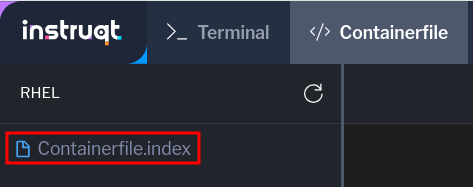

A word about tags
===

To this point, we've been letting podman automatically create tags for the images we've built. As a review, the naming convention for container images is `registry/name:tag`. We've been setting the registry and name in the command line, which means all of the tags are set to `latest` by default. While this is convenient, it can create a lot of confusion. Which `latest` was really created last? What in that container? Which updates did we provide?

Let's add some new content to our webserver in prepartion for deploying an application, then build it using a new tag.

Click on the [button label="Containerfile" background="#ee0000" color="#c7c7c7"](tab-1) tab.

If not already shown, select Containerfile in the list on the right side of the tab.




Add the following line after the `dnf install` line:

````
RUN echo "New application coming soon!" > /var/www/html/index.html
````


The editor will automatically save changes. Once you see Changes Saved in the upper right, you can return to the [button label="Terminal" background="#ee0000" color="#c7c7c7"](tab-0) tab.

Use podman to update the image.
===
With our changes in the Containerfile saved, we can run the `podman build` command to get an updated image, but this time with a specific `v2` tag.

```bash,run
podman build -t [[ Instruqt-Var key="CONTAINER_REGISTRY_ENDPOINT" hostname="rhel" ]]/test-bootc:v2 .
```
Tags communicate information to people, not the container tools. The tools will use the IDs associated to tag when doing operations. This means we can use tags to carry different kinds of information for users.

Push the image to the registry
===

Once the updated image has been built, we can push it to the registry. Once again, note how only the changed layers need to be added to the registry even though we created a new tag.

```bash,run
podman push [[ Instruqt-Var key="CONTAINER_REGISTRY_ENDPOINT" hostname="rhel" ]]/test-bootc:v2
```

There can also be more than one tag associated with an image. Let's say this image was for the development environment and not for production use. We could add a `dev` tag to our new image, and push that to the registry.
```bash,run
podman image tag [[ Instruqt-Var key="CONTAINER_REGISTRY_ENDPOINT" hostname="rhel" ]]/test-bootc:v2 [[ Instruqt-Var key="CONTAINER_REGISTRY_ENDPOINT" hostname="rhel" ]]/test-bootc:dev
```
```bash,run
podman push [[ Instruqt-Var key="CONTAINER_REGISTRY_ENDPOINT" hostname="rhel" ]]/test-bootc:dev
```

Let's take a look at the different imames created.
```bash,run
podman images test-bootc
```
You can see we have 3 images listed, but a closer look at the `IMAGE ID` column shows that 2 of them are the same.

With more sophiscated tools than available in this environment, the flexibility afforded by tags can be very powerful.

Switch to the v2 image
===

Click on the [button label="VM console" background="#ee0000" color="#c7c7c7"](tab-2) tab.

> [!NOTE]
> You may need to tap `enter` to wake up the console, you should still be logged in as `core`


The new version of our image didn't use the `latest` tag, so the changes won't show up as an update.

```bash,run
sudo bootc upgrade --check
```

Like in the first exercise where we chnaged registries, we can use `bootc switch` to change between tags. Using `bootc switch` we can use any of the image three identifiers (registry, name, and tag) to handle a variety of different scenarios.
```bash,run
sudo bootc switch [[ Instruqt-Var key="CONTAINER_REGISTRY_ENDPOINT" hostname="rhel" ]]/test-bootc:v2
```

We need to restart the system now to get our changes.

```bash,run
sudo reboot
```

Check the VM is running the v2 image
===

Once the system has completed rebooting, you can log back in.

Username:

```bash,run
core
```

Password:

```bash,run
redhat
```

Let's check what the `spec` section of `bootc status` now says about where we're looking for updates.
```bash,run
sudo bootc status | grep spec: -A 4
```

What about our new placeholder index page?

```bash,run
curl localhost
```

```bash,run
ls -alh /var/www/html/index.html
```

The new index doesn’t appear, and it’s also not on disk. This is expected based on how bootc handles directories and image contents during changes.

Stay logged into the VM to explore this in the next module.
