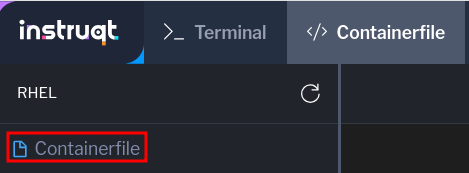
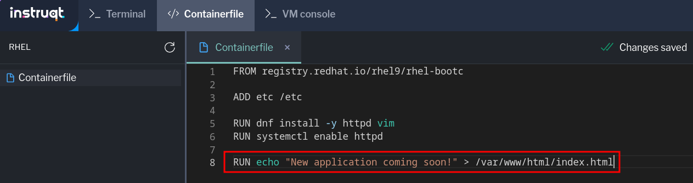

A word about tags
===

As a review, the naming convention for container images is `registry/name:tag`. Let's examine the different images that are currently on this host.

```bash,run
podman images
```

In the previous exercise, we used the `el10` tag when building the new RHEL 10 version of the image. You'll also see other images have version information in the TAG column. However, in other labs we didn't set an explicit tag, which means `podman` will use the default `latest` tag. While this is convenient, it can create a lot of confusion. What is in that `latest` container? Which updates did we provide? Have you seen the `latest` tag in any of the `bootc status` output so far?


Using tags for identifying image contents
===

Let's add some new content to our webserver in preparation for deploying an application, then build it with a new tag.

Click on the [button label="Containerfile" background="#ee0000" color="#c7c7c7"](tab-1) tab.

If not already shown, select Containerfile in the list on the right side of the tab.




Add the following line at the end of the file:

````
RUN echo "New application coming soon!" > /var/www/html/index.html
````



The editor will automatically save changes. Once you see Changes Saved in the upper right, you can return to the [button label="Terminal" background="#ee0000" color="#c7c7c7"](tab-0) tab. You can also use 'Ctrl s' or 'Cmd s' to save depending on your OS.

Use podman to build the image
===
With our changes in the Containerfile saved, we will run `podman build` to get a new image. But this time we'll set a specific tag by adding `v2` to the end of the container name. The container tools once again reuse the pre-existing layers, only adding one for our new web page.

```bash,run
podman build -t [[ Instruqt-Var key="CONTAINER_REGISTRY_ENDPOINT" hostname="rhel" ]]/test-bootc:v2 .
```

Push multiple tagged versions to the registry
===
Tags communicate information to people, not the container tools. The tools will use the IDs associated to tag when doing operations. This means we can use tags to carry different kinds of information for users.

Let's say we also wanted to let people know this image was for the development environment and not for production use. We could add a `dev` tag to our new image with the `podman image tag` subcommand. This tag is only applied locally, so we need push that to the registry as well.
```bash,run
podman image tag [[ Instruqt-Var key="CONTAINER_REGISTRY_ENDPOINT" hostname="rhel" ]]/test-bootc:v2 [[ Instruqt-Var key="CONTAINER_REGISTRY_ENDPOINT" hostname="rhel" ]]/test-bootc:dev
```

Look at the different images we've created.
```bash,run
podman images test-bootc
```
You can see we have 3 images listed, but a closer look at the `IMAGE ID` column shows that 2 of them are the same.

With more sophisticated tools than available in this lab environment, the flexibility afforded by tags can be very powerful.

We need to push our updated images to the registry to make them available for use. Notice that the `dev` tagged image only copies a config layer since all of the other layers are identical to the `v2` image.

```bash,run
podman push [[ Instruqt-Var key="CONTAINER_REGISTRY_ENDPOINT" hostname="rhel" ]]/test-bootc:v2
```
```bash,run
podman push [[ Instruqt-Var key="CONTAINER_REGISTRY_ENDPOINT" hostname="rhel" ]]/test-bootc:dev
```

Switch to the v2 image
===

Click on the [button label="VM SSH session" background="#ee0000" color="#c7c7c7"](tab-2) tab.

> [!NOTE]
> If the SSH session hasn't connected or there is an error, you can reconnect by clicking Refresh next to the tab name. The prompt will look like this. 

You can use the following credentials to log in.

Password:

```bash,run
redhat
```

Since tags are part of the image name, our new `v2` image is a different image than what `bootc` is tracking. We can use `bootc switch` to install it like we did in the first exercise to change to RHEL 10 initially. And since there are two tags in the registry that refer to the same image, you could use either `v2` or `dev` to install the new image.
```bash,run
sudo bootc switch [[ Instruqt-Var key="CONTAINER_REGISTRY_ENDPOINT" hostname="rhel" ]]/test-bootc:v2
```
Unlike the first exercise, `bootc switch` only pulls down the one updated layer.

Using `bootc switch` we can handle a variety of different scenarios that would require a different image than the one we booted that isn't a simple file update. We could test the upgrade of a core application component like a Java JDK by providing a new base image for the application. These sorts of system software changes are likely to be more common use cases than our full RHEL 10 swap.

We need to restart the system to apply our changes.

```bash,run
sudo reboot
```

Check the VM is running the v2 image
===

Once the system has completed rebooting, you can log back in by clicking the refresh button.

Password:

```bash,run
redhat
```

Let's check what the `spec` section of `bootc status` now says about where we're looking for updates.
```bash,run
sudo bootc status | grep spec: -A 4
```

There's the `v2` tag, so what about our new placeholder index page?

```bash,run
curl localhost
```

```bash,run
ls -alh /var/www/html/index.html
```

The new index doesn’t appear, and it’s also not on disk. Yes, there's a deliberate error in the instructions. This is expected based on how bootc handles directories and image contents during changes.

We'll explore this in the next exercise.
