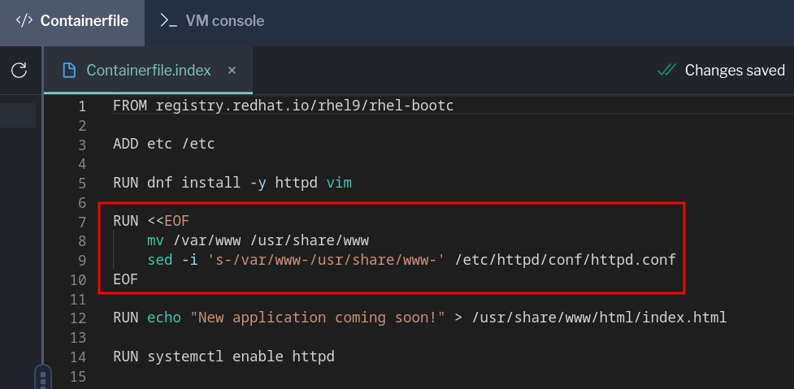

What happened to our index file?
===

We didn't see any errors from the `podman build` when we created the image, so what happened inside the image?

Since bootc images are still standard OCI images, we can test changes by running the image as a local container. Using standard container tools gives us new ways to iterate and inspect hosts without needing to completely install them first.

Let's launch the container and list the contents of the directory. Instead of running interactively and attaching a shell, we can just pass the command we want run to the container as an argument. We're also adding the `--rm` flag to make sure the container that runs the `ls` command is removed after the command exits.
```bash,run
podman run --rm [[ Instruqt-Var key="CONTAINER_REGISTRY_ENDPOINT" hostname="rhel" ]]/test-bootc:v2 ls /var/www/html
```

Image vs host state
===
The file is there, so why didn't it show up on the host? In [the image mode basics lab](https://www.redhat.com/en/introduction-to-image-mode-for-red-hat-enterprise-linux-interactive-lab), we discussed how `/etc` is treated in image mode. The `/var` hierarchy is also treated specially.

|directory|owner|bootc action|
|---|---|---|
|/usr|image|overwrite|
|/etc|host|merge|
|/var|host|ignore|

The `/var` directory is considered by `bootc` to be controlled by the host as local state. Since we want to manage web content at build time and version it with the image, we'll need to move it somewhere `bootc` will control.

Versioning files with the image
===
Let's look at a new Containerfile to see how we can do that.

Click on the [button label="Containerfile" background="#ee0000" color="#c7c7c7"](tab-1) tab.

Select Containerfile.index from the list on the right side of the tab.


Look at the new `RUN` command that uses the `heredoc` format to wrap several lines.



Heredoc support for Containerfiles is relatively new, but gives us a way to run a set of commands as a group that create a single layer. This works the same as stringing together several commands with `&`, which you've probably seen before. The `heredoc` is processed like a bash script, so you'll need to pay attention to things like variable expansion if you try to get complicated.

The first command in the `heredoc` makes sure we can see the commands as they get processed and exit the build if one of them fails. This way we don't have to wait until run time to see that `dnf` couldn't find a package we typo'd.

The rest of the `heredoc` does the work of relocating the docroot. The second command in this block will move the directories and files installed by Apache to a new directory under `/usr`. The third will update the htttpd config file to change the default document root to our new directory.

Since we haven't made any changes on our bootc host to this file in `/etc`, this change will be applied by `bootc`. If you had made local changes to the httpd config, you may need to create a drop-in file or use some other means to update the Apache config.

Once you feel you understand the change, you can return to the [button label="Terminal" background="#ee0000" color="#c7c7c7"](tab-0) tab

Use podman to build the image.
===
We can pass this new file to the `podman build` command with the `-f` option and we'll also give it a `v3` tag. Adding this kind of versioning semantics can help folks understand what's current in a series of updated images.

```bash,run
podman build -t [[ Instruqt-Var key="CONTAINER_REGISTRY_ENDPOINT" hostname="rhel" ]]/test-bootc:v3 -f Containerfile.index
```

Let's test the new image for our new file location the same way we did earlier, by running the container locally.
```bash,run
podman run --rm [[ Instruqt-Var key="CONTAINER_REGISTRY_ENDPOINT" hostname="rhel" ]]/test-bootc:v3 ls /usr/share/www/html
```

Now that we're sure we have the changes we need, we can push it to the registry. Once again, note how only the changed layers need to be added to the registry even though we changed directory contents and created a new tag.

```bash,run
podman push [[ Instruqt-Var key="CONTAINER_REGISTRY_ENDPOINT" hostname="rhel" ]]/test-bootc:v3
```

Switch the VM to our newest version
===
To update the VM, return to the the VM by clicking on the [button label="VM SSH session" background="#ee0000" color="#c7c7c7"](tab-2) tab.

> [!NOTE]
> If the session hasn't connected or there is an error, you can reconnect by clicking Refresh next to the tab name. The prompt will look like this.  If you are already logged in, you may not have rebooted after the rollback.

Log in with the following credentials:

Password:

```bash,run
redhat
```

Just like in the other exercises, we can use `bootc switch` to change to the image we just created with the updated Apache config.
```bash,run
sudo bootc switch [[ Instruqt-Var key="CONTAINER_REGISTRY_ENDPOINT" hostname="rhel" ]]/test-bootc:v3
```

You may notice that there's a new line in the output of `bootc switch` that mentions pruning an image. One design element to keep in mind is that there will be at most 3 images on disk: the currently running image, the roll back target, and the next image to take effect.

Check that the new image has been staged for the next boot.
```bash,run
sudo bootc status
```

You can also check the boot order in the spec block to see what has been sent to the bootloader. Notice it's back to `default`.
```bash,run
sudo bootc status | grep Order
```

Let's go ahead and restart the system one last time to get our changes.
```bash,run
sudo reboot
```

Once the system has completed rebooting, you can log back in.

Password:

```bash,run
redhat
```
What about our new placeholder index page?

```bash,run
curl localhost
```

We have a new docroot that is controlled from the image. We can use this idea with any software or other content we want to ensure is part of our standard build rather than managed at runtime on a host.

You've now explored how to change the image that a host is tracking, gained some insights into the differences between directory states, and been able to roll back from an image update. This should provide a good basis to explore image mode further on your own!
