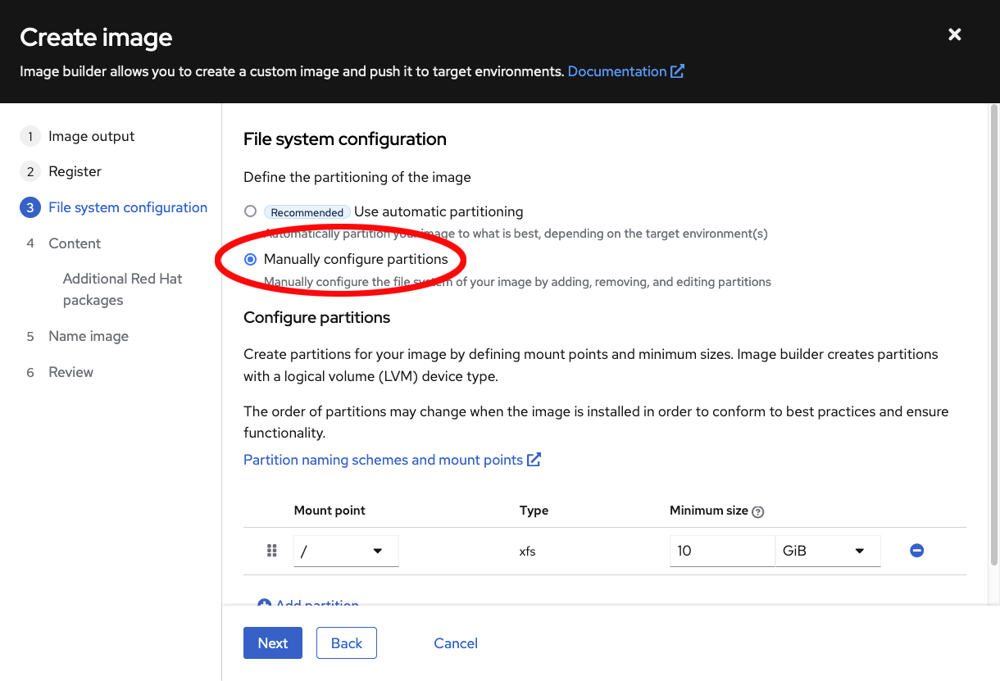
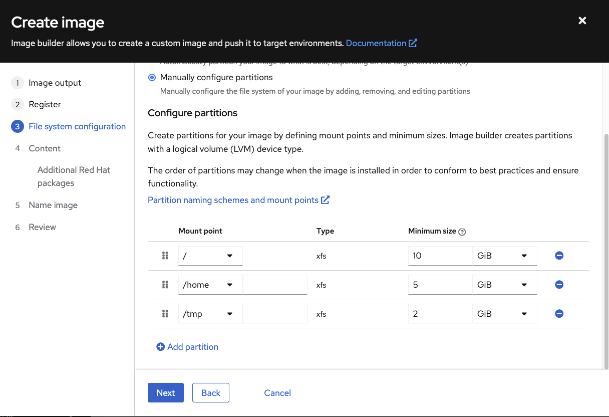
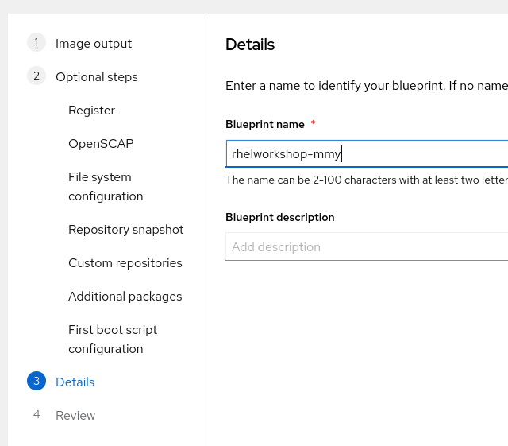
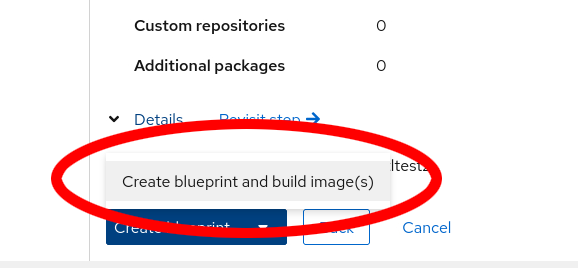
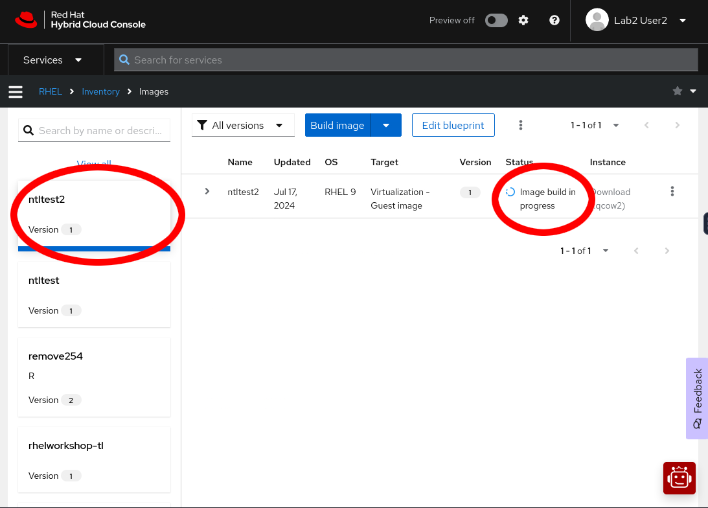

>_NOTE:_ To make the inline images larger, expand this window.

Press the `Create blueprint` button and you will be brought to the Create image wizard.  This wizard will ask you to define several aspects of your new image.  Image builder can define a custom filesystem layout, add packages to your image, and even send it right to your cloud provier if you'd like.

## Step 1: Specify image format
=======================
In Step 1. Image output, Let's select only `Virtualization - Guest image (.qcow2)`.  But take note of the various options Image Builder gives you for what format you'd like your image built in.

We will also be setting the Release to `Red Hat Enterprise Linux (RHEL) 9`, but notice that you can also select several other releases for production and development use cases.

With these options selected, Press `Next`.

## Step 2: Configure Insights registration
==========================================
Step 2 is all about how you would like to register this system.  Even in the cloud, this type of image assumes you will be bringing your own subscription.  You can register automatically with an activation key, or you can choose to register yourself later (either manually or using automation).

To keep this lab simple, let's choose to `Register later`

Now press the `Next` button.

## Step 3: OpenSCAP Profile
===========================
In Step 3, you can select an OpenSCAP profile.  This will apply an OpenSCAP compliance policy to this image when it is built.  This is great for environments that must adhere to compliance standards, or admins that are just looking to add some security best practices to their base image.

For this lab, we'll leave this set to None, and press Next.

## Step 4: Partitioning storage
===============================
In Step 4, we can manually configure the partitions of this system, or we can choose to let Image Builder set things up for us automatically. Let's choose `Manually configure partitions`, this will open up a table below where we can add new partitions.

Now, you can use the `Add partition` button to add more partitions. You can also change the size or mount point of existing partitions in the table.  Even remove partitions that you may have added by mistake.

Let's use the `Add partition` button to add a 5GiB /home and 2GiB /tmp to our image.  You should end up with the following layout.

>_NOTE:_ This partition layout is for example purposes only, and not a recommended production system layout. More information on manual partitioning recommendations can be found in the [Red Hat Enterprise Linux 9 Installation guide](https://access.redhat.com/documentation/en-us/red_hat_enterprise_linux/9/html/performing_a_standard_rhel_9_installation/assembly_customizing-your-installation_installing-rhel#manual-partitioning_graphical-installation).

Once your partition table looks like the one pictured above, press `Next`.

## Step 5: Specify software
===========================
Step 5 lets us select packages that we would like installed on our system.  The base image produced by Image Builder is intended to be small, and make very few assumptions about your desired package set.  So having the ability to add in packages here can save you time later.  For this lab, let's leave the default package set in place.  Just be aware that if you wanted to add some packages, you could do so in this step.

Press the `Next` button.

## Step 6: Name your image
==========================
On Step 6 you'll just need to give your image a name.  This should be unique, so try something like `rhelworkshop-(your initials)`

Press `Next`.

## Step 7: Review image configuration
=====================================
Step 7 is just a review.  You can review the choices you've made and go back and make changes if you need to.  If everything looks right, just press the down-arrow next to the `Create blueprint` button and click `Create blueprint and build image(s)`.  This will save the blueprint definition, and start the build process.

This will submit your job to the Image Builder queue, and bring you back to the list of images.  Once the image build process completes, your image will be ready for download, or give you the option to launch it on your cloud provider if you chose to push it to the cloud, after the image is built.

In the next step of this lab we'll have a look at an image that was built with the same specifications to the one you defined here.
