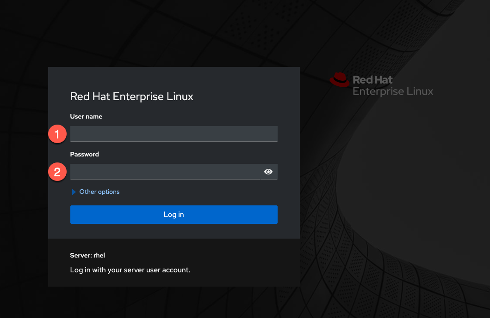
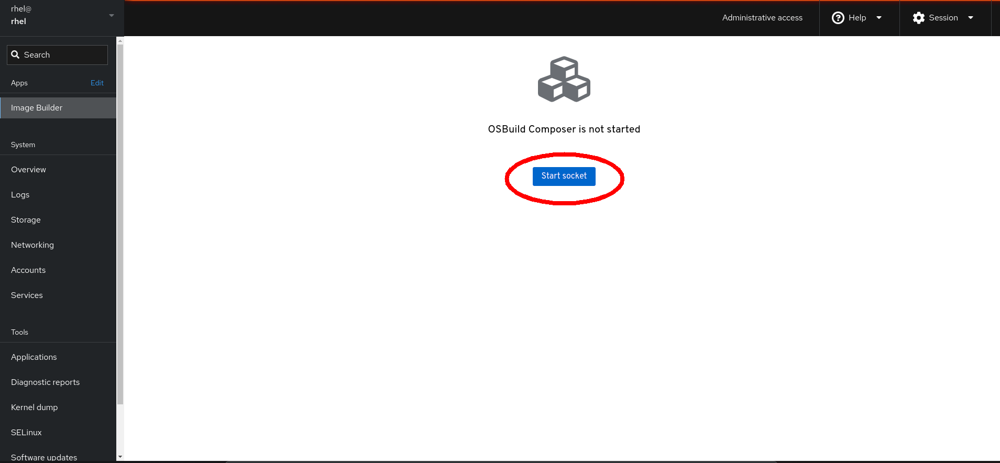

## Log in to the Web Console

Click on the tab titled **RHEL Web Console** at the top of  your lab system interface. Selecting this tab will open the lab system's Web Console in a
new browser tab or window.


Click `Advanced`


Then click `Proceed to rhel.xxxx.instruqt.io`


Once the login page is presented, use the following credentials to log into the Web Console:

1 - Username:

```bash
rhel
```

2 - Password:

```bash
redhat
```



Now that you are logged into the Web Console, we must turn on administrative access.

Click `Turn on administrative access`.


Next do the following:

1) Enter the password: **redhat**
2) Click `Authenticate`


## Navigate to Image Builder application

After logging into the Web Console, you'll be looking at the Overview tab. Navigate to the Image Builder tab, as shown below:


Because you have not used Image Builder before, you will need to start the back-end service by clicking the *Start* button.



Now that the back-end service has been started, you will notice that the application screen updates and you can now *Create Blueprint*, which is what you will do on the next step.
