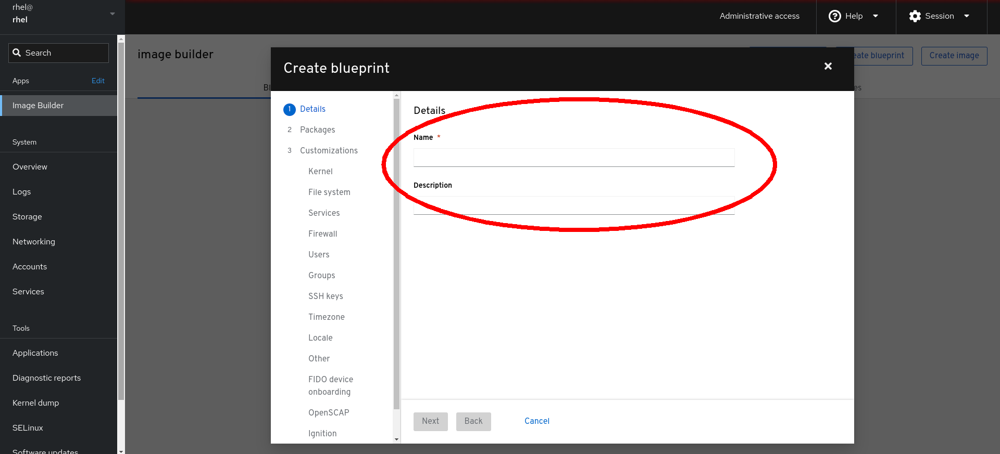
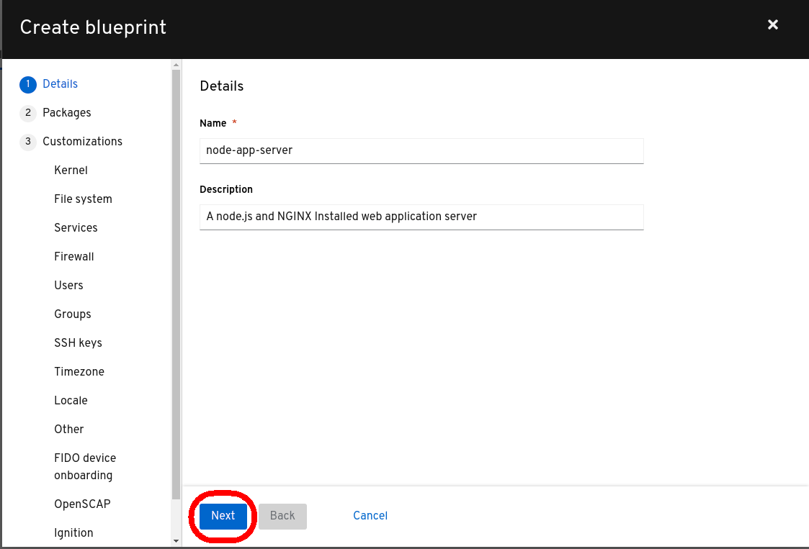
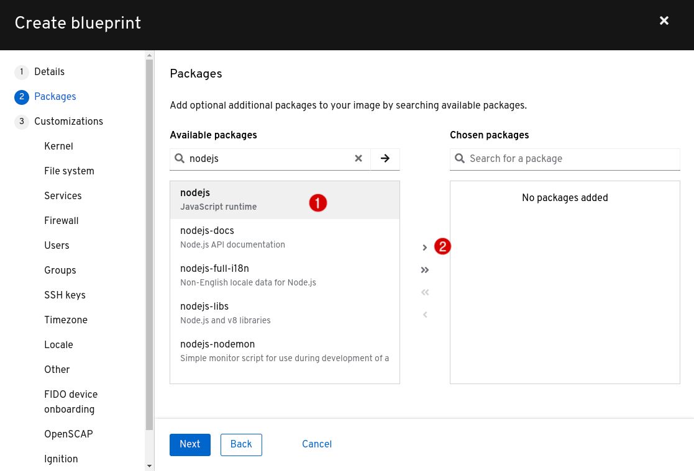
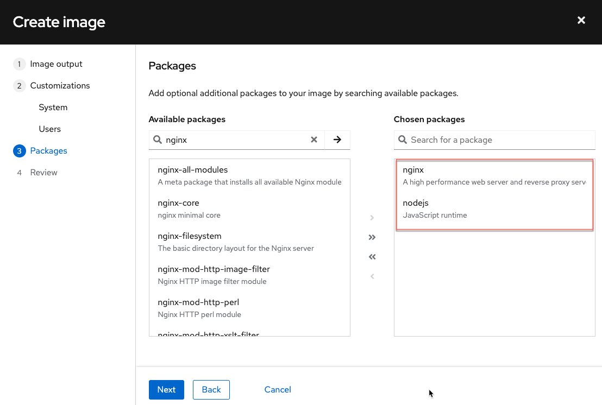
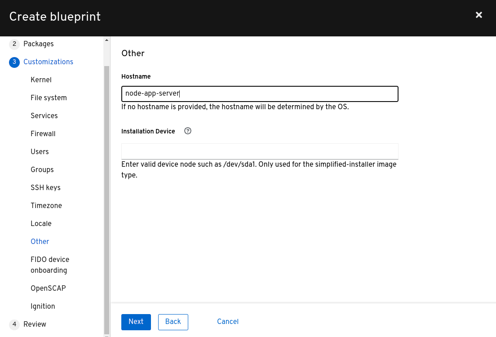
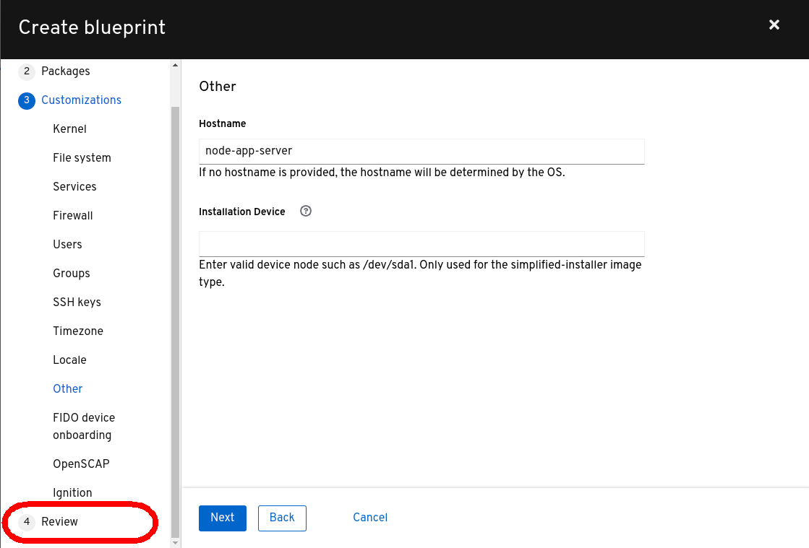
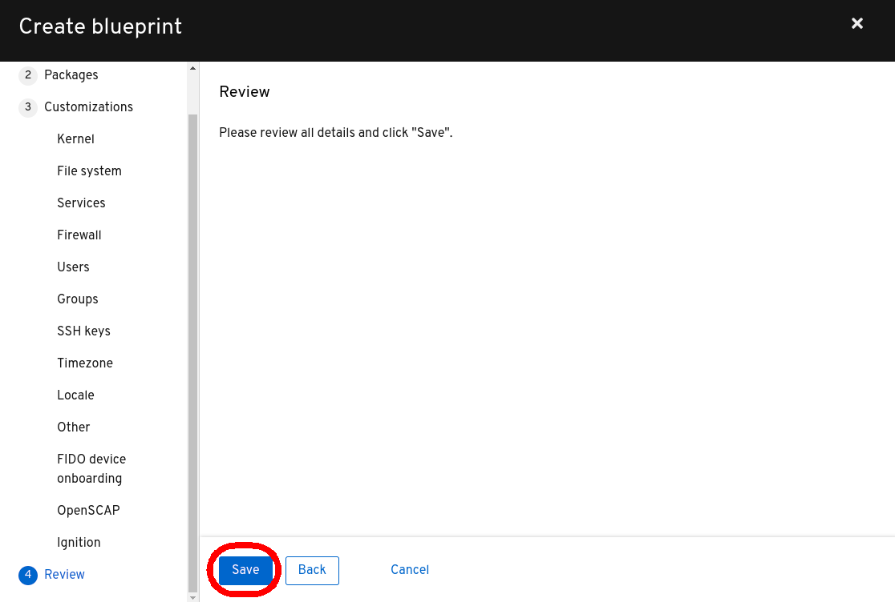

## Create a blueprint

Image Builder uses blueprints to create system images, however, none exist on this system  yet.

Select the *Create Blueprint* button to start building your first blueprint.

The first step to creating a new blueprint is naming it.  It is recommended that you also include a description so that others using this blueprint know what system image they are building.  For this lab, use __node-app-server__ as the *Name* and __A node.js and NGINX installed web application server__ as the *Description*.

Click `Next`.

Next we'll customize the blueprint.

Add in the first package, `nodejs`, into the `Available packages` search bar. Once the filter has been applied, you should now see packages with `nodejs` included in their name.

1) Click on `nodejs`.
2) Click the `>` symbol to add it.

Repeat these actions for the `nginx` package and then click `Next`.

Keep clicking the `Next` button until you reach the `Other` tab of the customizations section within the blueprint creation dialog. As you can see, image builder provides the ability to add custom kernel parameters, add users, open firewall ports, and more.

Then, enter a hostname `node-app-server` for the image.

Next, click `Review`

Finally, click `Save` to save the blueprint.
