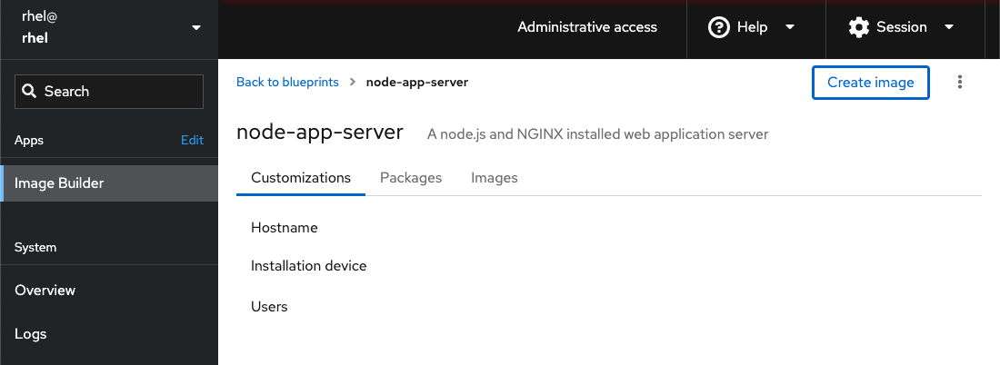

## Create a blueprint

Image Builder uses blueprints to create system images, however, none exist on this system  yet.

Select the *Create Blueprint* button to start building your first blueprint.

The first step to creating a new blueprint is naming it.  It is recommended that you also include a description so that others using this blueprint know what system image they are building.  For this lab, use __node-app-server__ as the *Name* and __A node.js and NGINX installed web application server__ as the *Description*.

Click `Create`.

Next we'll create an image.
