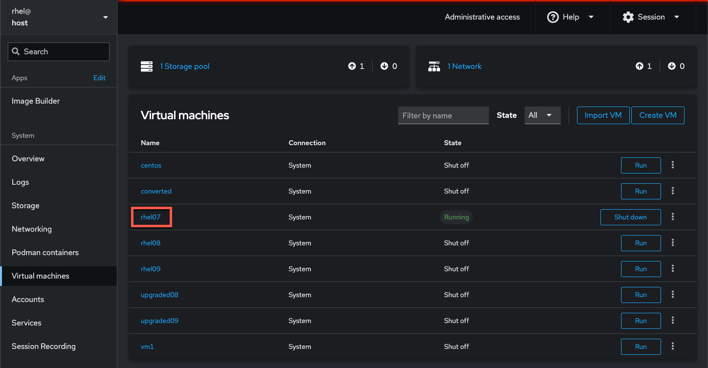
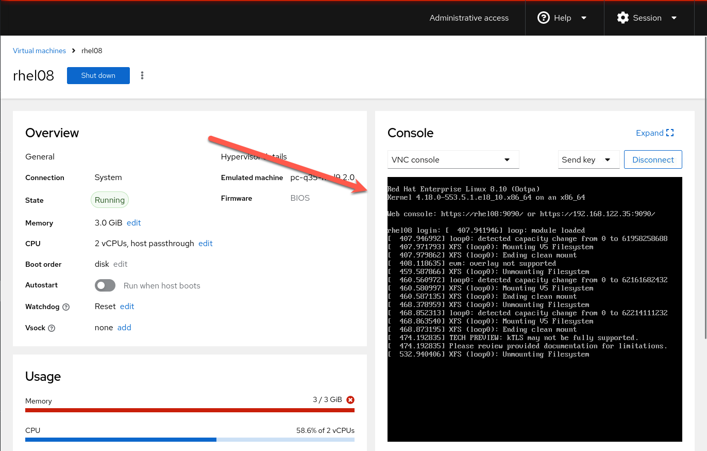

Running the upgrade
===

Now that you have verified the RHEL system meets all the expected conditions, it is time to kick off the upgrade process:
(Note: This process will take awhile.)

```bash,run
leapp upgrade --target 9.4
```

<pre class=file>
# leapp upgrade --target 9.4
==> Processing phase `configuration_phase`
====> * ipu_workflow_config
        IPU workflow config actor
==> Processing phase `FactsCollection`
====> * scanblacklistca
        Scan the file system for distrusted CA's in the blacklist directory.
====> * sssd_facts_8to9
        Check SSSD configuration for changes in RHEL9 and report them in model.
====> * nis_scanner
        Collect information about the NIS packages configuration.
====> * scan_target_os_image
        Scans the provided target OS ISO image to use as a content source for the IPU, if any.

... output truncated ...

Debug output written to /var/log/leapp/leapp-preupgrade.log
============================================================
                           REPORT
============================================================
A report has been generated at /var/log/leapp/leapp-report.json
A report has been generated at /var/log/leapp/leapp-report.txt
============================================================
                       END OF REPORT
============================================================
Answerfile has been generated at /var/log/leapp/answerfile
</pre>

> [!IMPORTANT]
> The Leapp process can take upwards of 15 minutes to run.
<!-- The Leapp process can take upwards of 15 minutes to run. Instead of waiting for that process to complete, a second server has been running the upgrade in the background. If you would like to save some time switch to the 'webconsole' tab to finish the **Verifying the upgrade** section. -->

<!-- 

The upgrade has only been _staged_; it has not been completed at this point. A reboot is required for the RHEL 9-based initial RAM disk image (initramfs), upgrades all packages and automatically reboots to the RHEL 9 system. -->
If you would like to proceed with the lab without waiting for the upgrade to complete, click on the `Upgraded RHEL` tab and continue in that terminal. You can skip the reboot step below. Proceed to the step `Verifying the upgrade` below.

A reboot is required for the RHEL 9-based initial RAM disk image (initramfs), upgrades all packages and automatically reboots to the RHEL 9 system.

> [!NOTE]
> You can combine these two steps with the --reboot option
> `leapp upgrade --target 9.4 --reboot`

```bash,run
reboot
```

Now, leapp is performing several actions inside a temporary environment. This includes creating a new initramfs image, relabeling SELinux contexts, and well as cleaning up any remaining RHEL 8 packages. The reboot process can take up to 15 minutes.

The `Optional step` below shows how you can view the reboot/upgrade process.

Verifying Reboot (Optional)
=============
This step is optional but it may provide insight into the upgrade process. This lab provides a web console UI to the virtual machine host. You can log into the web UI to view the upgrade process after `reboot` has been executed.

Click on `RHEL Web Console`to log into the web UI.


Use the following credentials to log into the web console.

Username
```
rhel
```

Password
```
redhat
```


Next, give yourself administrative access by clicking on the button `Turn on administrative access` and entering the password `redhat` again.


Navigate to `Virtual machines`


Click on `rhel08`


You can now view the upgrade process in the console window.



Please continue to `Verifying the upgrade` below.

Verifying the upgrade
=====================
Once the new initramfs image is in place, package updates run, and SELinux relabel completion, the system will perform one final reboot.

Refresh the Instruqt console to log back into your host, by clicking the button shown below.


Once that is done, you will be logged into the system's terminal once more. Finally, we will verify the update was successful by looking at the release file we referenced earlier in the lab:

```bash
cat /etc/redhat-release

```

Note that we are now running the latest version of RHEL 9!

<pre class=file>
# cat /etc/redhat-release
Red Hat Enterprise Linux release 9.4 (Plow)
</pre>

OPTIONAL: You may also review the log file if you so choose. The full output is available at /var/log/leapp/leapp-upgrade.log

```bash
sudo less /var/log/leapp/leapp-upgrade.log

```

There are other methods for upgrading to the latest version of RHEL using the leapp tooling including the Web Console and Satellite. For those operations, refer to the documentation on Red Hat's website.