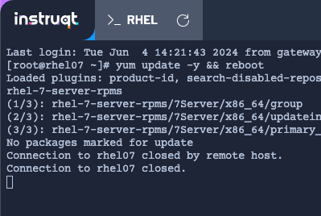

What is Leapp?
===

Red Hat's leapp tool provides existing Red Hat Enterprise Linux 7 and 8 instances to an upgrade path from one major version to the next. This can be done on a one-to-one basis or en mass with a tool like Satellite. The Leapp tooling also includes a pre-upgrade assistant that makes it easy to identify breaking changes or warn about potential issues before any lasting changes are made to the system.

Before diving in, the question you have to ask is: is this workload worth executing a rebuild from scratch? That process can be tedious and time consuming. Doing an in-place upgrade retains the subscription, installed packages, user data, and configurations all while saving the time and resources required to deploy fresh.

Installing Leapp
===

To get started, it is highly recommended that you update all packages on your system to the latest version available:

```bash,run
yum update -y && reboot
```

The terminal will lose connection with the rhel07 host leaving the message `exited`.



You can reconnect the session in the `rhel07` tab if desired. Refresh the `rhel07` tab until you are reconnected.


Leapp is a supported operation for RHEL which means support tickets can be opened in case obstacles are encountered. It also means that the leapp utility is available straight from the Red Hat package repository. First, verify the version of Red Hat Enterprise Linux that you have installed:

```bash,run
cat /etc/redhat-release
```

<pre class=file>
# cat /etc/redhat-release
Red Hat Enterprise Linux release 7.9 (Maipo)
</pre>

First, you need to enable the rhel-7-server repositories using the subscription-manager command:
>**Pro Tip:** See how you can actually combine these two operations into one!

```bash,run
subscription-manager repos --enable rhel-7-server-rpms --enable rhel-7-server-extras-rpms
```

<pre class=file>
# subscription-manager repos --enable rhel-7-server-rpms --enable rhel-7-server-extras-rpms
Repository 'rhel-7-server-rpms' is enabled for this system.
Repository 'rhel-7-server-extras-rpms' is enabled for this system.
</pre>

Next, use the DNF package manager to install leapp and its dependencies:

```bash,run
dnf install -y leapp-upgrade
```

<pre class=file>
# dnf install -y leapp-upgrade
# dnf install -y leapp-upgrade
Red Hat Enterprise Linux 7 Server - Extras (RPMs)                                                                                                                                                      0.0  B/s |   0  B     00:00
Red Hat Enterprise Linux 7 Server (RPMs)                                                                                                                                                               0.0  B/s |   0  B     00:00
Dependencies resolved.

... output truncated ...

Installed:
  leapp-upgrade-el7toel8-0.18.0-1.el7_9.noarch leapp-deps-0.15.1-1.el7_9.noarch     leapp-0.15.1-1.el7_9.noarch  python2-leapp-0.15.1-1.el7_9.noarch  leapp-upgrade-el7toel8-deps-0.18.0-1.el7_9.noarch python-IPy-0.75-6.el7.noarch
  setools-libs-3.3.8-4.el7.x86_64              libsemanage-python-2.5-14.el7.x86_64 checkpolicy-2.5-8.el7.x86_64 audit-libs-python-2.8.5-4.el7.x86_64 policycoreutils-python-2.5-34.el7.x86_64

Complete!
</pre>

Verify the install was successful:

```bash,run
leapp --version
```

<pre class=file>
# leapp --version
leapp version 0.17.0
</pre>