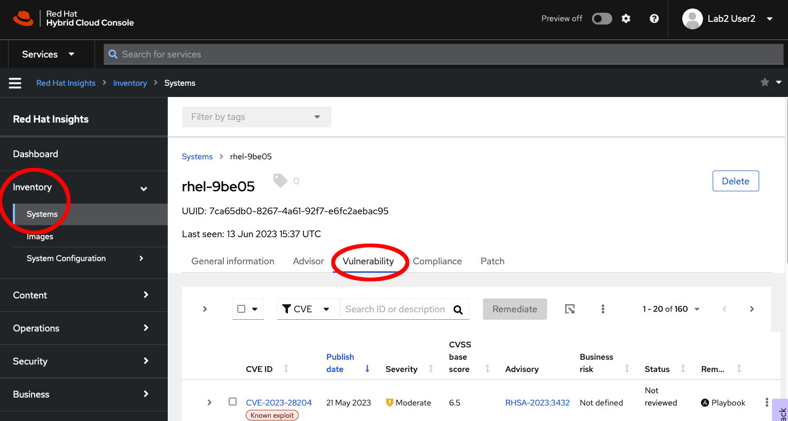
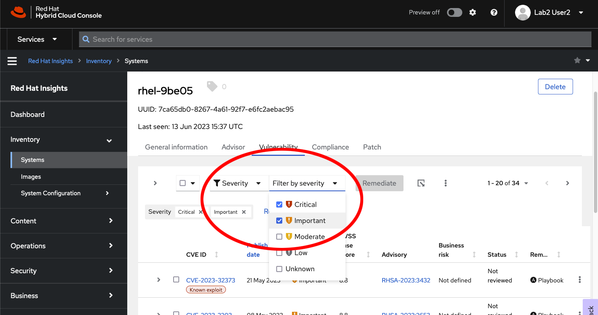

After providing the report generated in the previous step to your auditors, they have asked you to find, and fix any vulnerability classified as Important or Critical.  For the purposes of this lab, we will perform these tasks on just our lab host.  To find CVEs on our host that match this criteria, browse to *Inventory -> Systems* on the menu to the left, and find the host that matches the hostname you recorded in Step 1. Click on it, and then select the Vulnerabilty heading within the host information pane.



You should see a list of any vulnerability that is impacting this host, but we want to filter these by severity.  Insights makes this simple.  You will see a filter option at the top of the list of vulnerabilities, in the drop-down list select Severity.

And then in the Filter by severity drop-down, check off both Critical, and Important. The list of CVE's should automatically filter down to just Critical and Important vulnerabilities.



From this list of vulnerabilities, you can create a remediation playbook for any, or all, of the CVEs.  Or you can view their security advisory, and remediate manually.  With a Smart Management subscription, you can even launch a remote job to remediate the issue right from this console.

For now, let's just update the packages related to one of the CVE's in the list.  Find the CVE id for one of the vulnerabilities in the list, we'll use `CVE-2022-3515` for our example.

>NOTE: The CVE id in this example may not be in the list of vulnerabilities for your host, you should choose one from the list that Insights is listing for your lab host.

Keep your insights web browser open, and in the console for our host issue the following command, substituting the CVE id in the command for the one you chose from your list of Vulnerabilities.

```
dnf update -y --cve CVE-2022-3515
```

>NOTE: The `--cve`  flag for `dnf` tells it to apply the packages that are associated with this specific CVE.  And `-y` simply tells dnf not to ask us to confirm the installation.

<pre type=file>
Updating Subscription Management repositories.
Last metadata expiration check: 0:10:40 ago on Fri 09 Dec 2022 02:46:07 PM UTC.
Dependencies resolved.
==========================================================================================================================================================
 Package                       Architecture                 Version                             Repository                                           Size
==========================================================================================================================================================
Upgrading:
 libksba                       x86_64                       1.5.1-5.el9_0                       rhel-9-for-x86_64-baseos-rpms                       158 k

Transaction Summary
==========================================================================================================================================================
Upgrade  1 Package

Total download size: 158 k
Downloading Packages:
libksba-1.5.1-5.el9_0.x86_64.rpm                                                                                          473 kB/s | 158 kB     00:00
----------------------------------------------------------------------------------------------------------------------------------------------------------
Total                                                                                                                     471 kB/s | 158 kB     00:00
Running transaction check
Transaction check succeeded.
Running transaction test
Transaction test succeeded.
Running transaction
  Preparing        :                                                                                                                                  1/1
  Upgrading        : libksba-1.5.1-5.el9_0.x86_64                                                                                                     1/2
  Cleanup          : libksba-1.5.1-4.el9.x86_64                                                                                                       2/2
  Running scriptlet: libksba-1.5.1-4.el9.x86_64                                                                                                       2/2
  Verifying        : libksba-1.5.1-5.el9_0.x86_64                                                                                                     1/2
  Verifying        : libksba-1.5.1-4.el9.x86_64                                                                                                       2/2
Installed products updated.

Upgraded:
  libksba-1.5.1-5.el9_0.x86_64

Complete!
</pre>