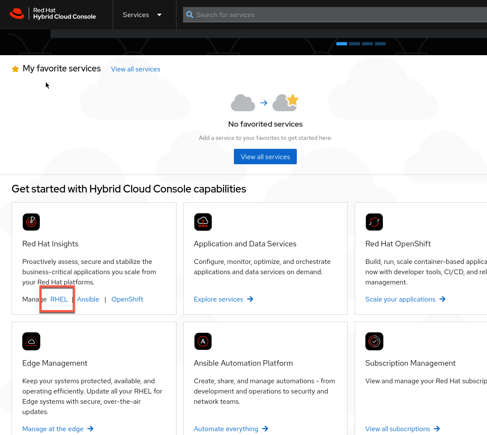

>_NOTE:_ To make the inline images larger, expand this window.


Image builder is a tool that can be used to build a custom Red Hat Enterprise Linux base image.
This image can then be deployed across your infrastructure, bare metal, virutal, and cloud.  The Image Builder Service is a version of this tool hosted on the Red Hat Hybrid Cloud Console, at https://cloud.redhat.com, and allows you to design an image without requiring you to install or configure anything locally.  You can also push these images to your cloud provider once they are complete, right from Image Builder itself.

First, let's head over to Red Hat's Hybrid Cloud Console, and login.  You should login with the following login and password:

Login:

```bash
rhel-df93
```

Password:

```bash
Redhat1!
```


Once you are logged in, navigate to the RHEL menu in Red Hat insights.



Click on `Inventory`, then `Images`.


Proceed to the next challenge by clicking the `Next` button.


