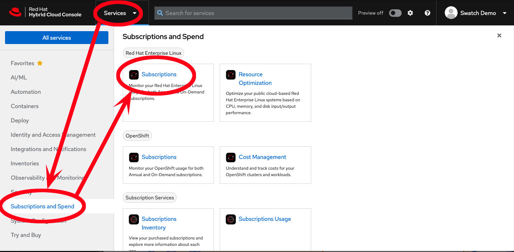

>_NOTE:_ To make the inline images larger, expand this window.


Red Hat Insights Subscirptions is a service hosted on the Hybrid Cloud Console, that can be used to keep track of your Red Hat Enterprise Linux subscription usage.

First, let's head over to Red Hat's Hybrid Cloud Console, and login.  You should login with the following login and password:

Login:

```bash
swatch_demo_user
```

Password:

```bash
Redhat1!
```
>_NOTE:_ You must use the ctrl-v (or command-v on Mac) keyboard shortcut in order to paste in the embedded browser tab in this lab


Once you are logged in, navigate to **Services** at the top, then to **Subscriptions and Spend** in the menu on the left, and then finally select **Subscriptions** under the _Red Hat Enterprise Linux_ heading.

>_NOTE:_ Your view may differ from these examples depending on your web browser window's size.




Now, we can get started by clicking the `Next` button at the bottom of this panel.
