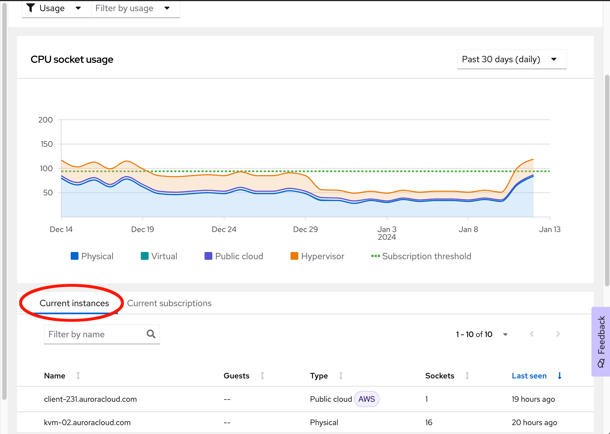
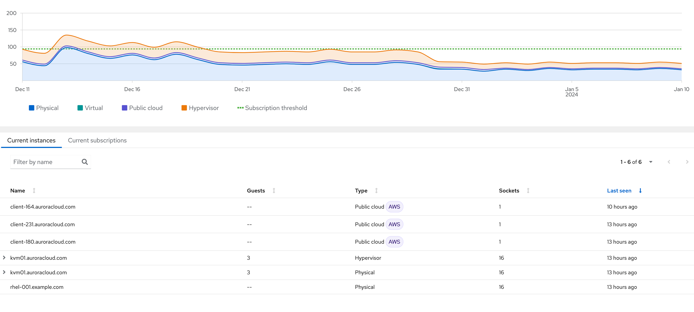

Below the usage graph, you'll find the _Current Instances_ tab.  If it is not already selected, click on it.

Your list should look similar to this:

In this tab, you'll find:
* **Name** - Known hostname of the system.
* **Guests** - Number of virtual guests running on the system (if the system is a hypervisor). This value is set to “--” if the system isn’t hosting any guests
* **Type** - Class of system as determined by DMI data and host/guest mapping data
* **Sockets** - The number of sockets which this system requires subscription coverage for.
  * _Note 1:_ This may differ from the number of sockets actually installed in the system. Example: Red Hat Enterprise Linux is generally sold per socket-pair (every 2 sockets), so a single socket server would show in the subscription service as requiring coverage for 2 sockets.
  * _Note 2:_ if the sockets value is “--”, this denotes a system which does not require subscription coverage as it has been paid for via a different means, usually a cloud marketplace. These systems will show in the ‘current instances’ list, but do not contribute to the usage chart.
* **Last Seen** - When was this system last seen in the subscription service.

In the next step, we'll cover the _Curent Subscriptions_ tab.
