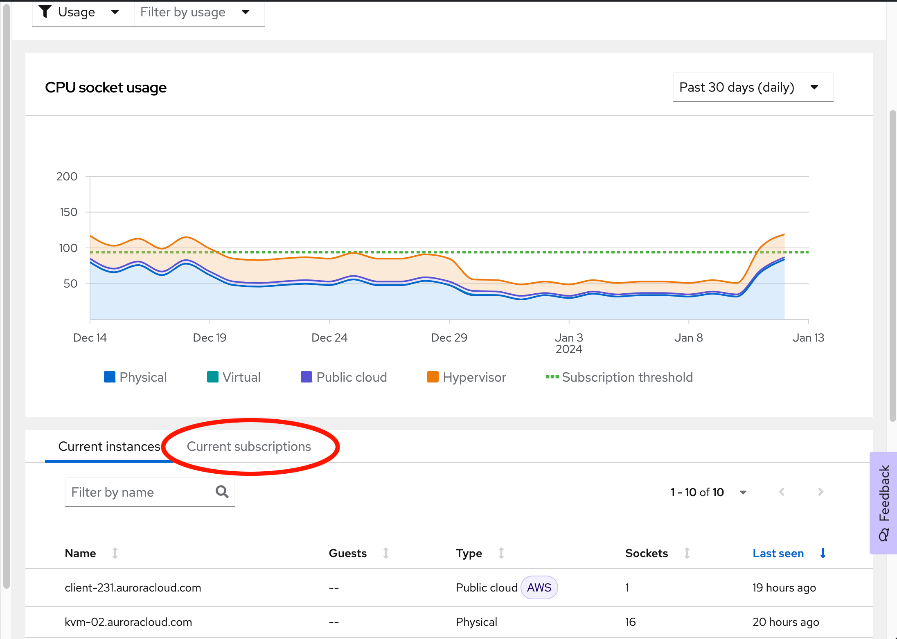
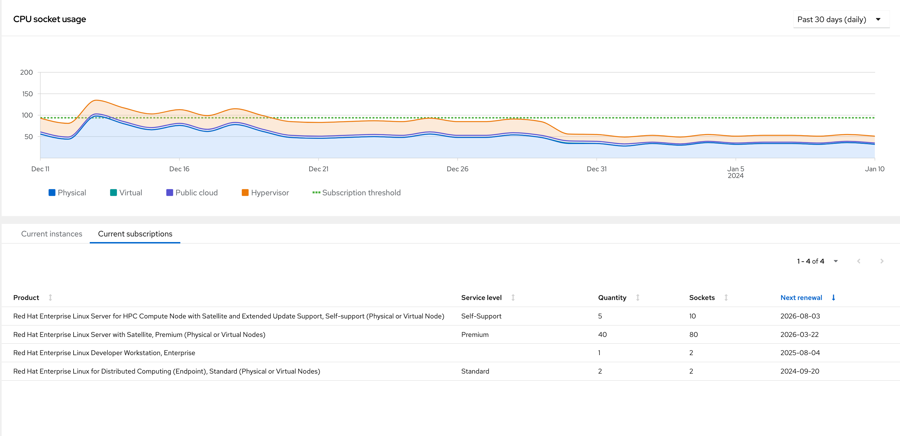

Below the usage graph, you'll also find the _Current Subscriptions_ tab.  Click on that and we'll have a look at its contents.

Your list should look something like this:

On this tab, each entry includes the:
* *Product* - The name of the subscription
* *Service Level* - What is the expectation of support from Red Hat?
* *Quantity* - How many of these subscriptions have been purchased.
* *Sockets* - The total amount of sockets provided.
* *Next Renewal* - The next date a renewal for this subscription is occuring

Next, we'll have a look at that usage graph at the top.
