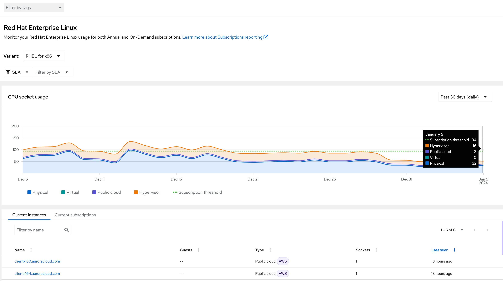

Now, let’s look at the **usage chart**. You can hover over any date in the chart in order to get the summary for that day. If your usage exceeds your subscription threshold, you can address this via a number of means:

* Purchasing additional subscriptions
* Powering down workloads
* Reporting the additional deployments at your next buffer/true-up or contracted reporting window.

In the next step, we'll have a look at filtering the data.

