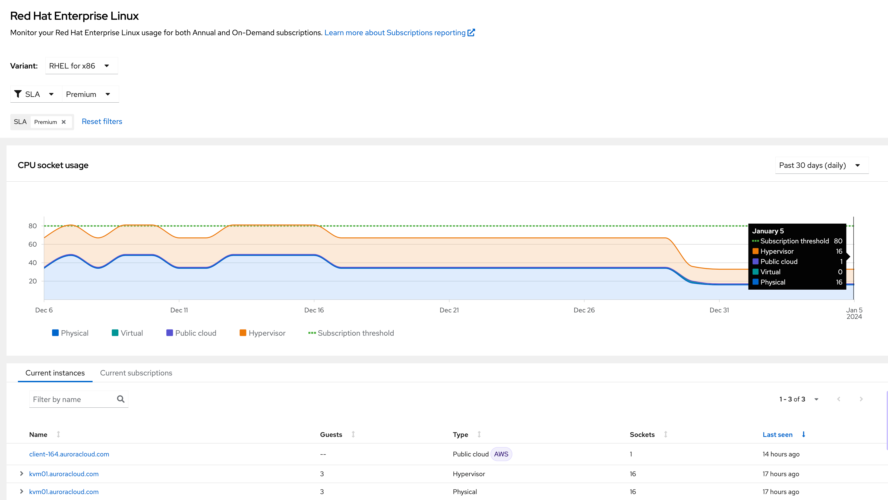
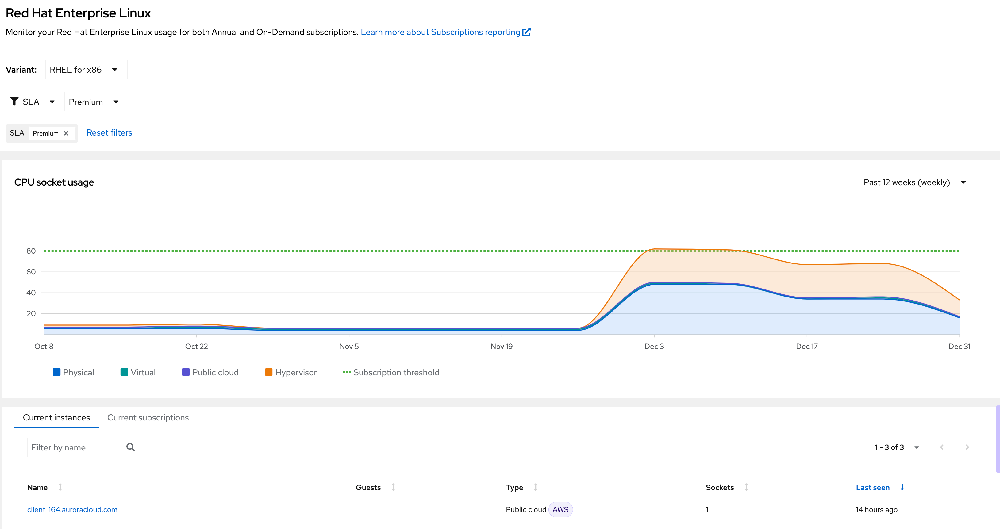

Filtering

Now that we have a good understanding of how the subscription service is laid out, our manager wants to understand how much **Premium** RHEL is in use.

To do this, we’ll use the filtering functionality of the subscription service. Select the SLA drop-down and select **Premium**.

You’ll notice that ALL three aspects of the page will change to match your filter of **Premium**:

The usage chart now changes to reflect **only** those subscriptions and systems which are Premium.
The **Current Instances** tab only shows systems which are tagged Premium
The **Current Subscriptions** tab only shows subscriptions with a Premium SLA.

We can also leverage the subscription service to “look into the past” to get an idea of what our previous usage was. This is useful if you want to do forecasting for future purchases. Next, we’ll use the date range selector (in the upper right) to show our usage from the past quarter. Select “Past 12 weeks (weekly)” as your date range, and again, you’ll see your usage chart change to match the selected date range.

Next, we'll look into addon and other product subscriptions.
