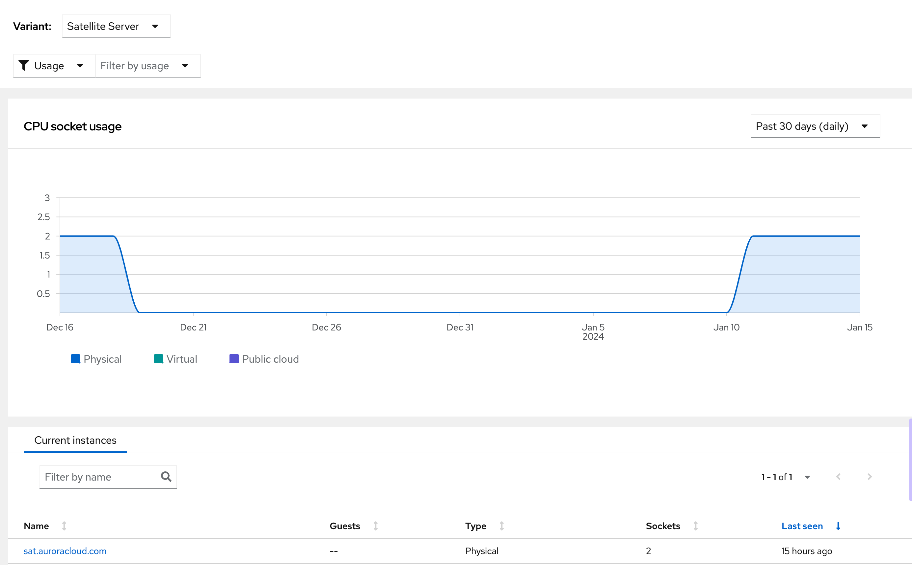

Other Variants & Products

In addition to being able to show usage for “base RHEL”, the Subscriptions service can also show usage for RHEL addons (RHEL High availability and resilient storage), layered products (like Satellite), and other products (like OpenShift).

In this example, we want to take a look at the size of our Satellite Server environment. We can do this by selecting “Satellite Server” from the **Variant** drop down.

We hope this lab has helped you see that the Subscriptions Service provides simple insight into your Red Hat product usage and makes it easy for you to see that usage, and make operational decisions based upon it.

