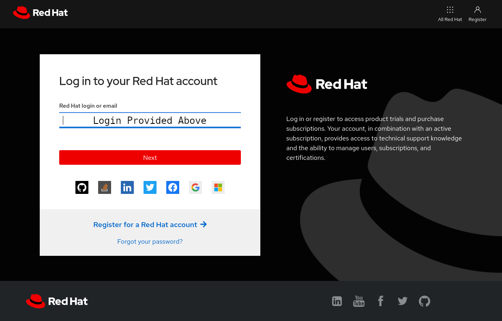

# Logging into Red Hat Insights service

>_NOTE:_ To make the inline images larger, expand this window.


There is a tab open inside of the lab environment for the Red Hat Hybrid Cloud Console, click on that, and you will be brought to the login page.

>_NOTE:_ This will open an additional browser window or tab.

Click the _Log In to the console_ button.


Login using the credentials below:

Login:

```bash
rhel-df93
```

Password:

```bash
Redhat1!
```




Once you are logged in, using the credentials provided above, navigate to
_Red Hat Enterprise Linux_ in the left-side navigation menu, and select _Red Hat Insights_ below it.


